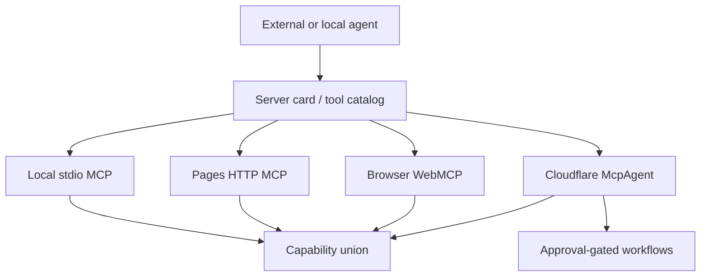

# MCP Gateway

The Agentic Canvas OS gateway is discovery-first federation over existing MCP surfaces. It is not a fifth monolithic proxy and must not duplicate dispatch logic already owned by local or control-plane servers.

## Federated Surfaces

| Surface | Role | Trust boundary | Token spend |
|---|---|---|---:|
| Local stdio MCP | Richest local/dev tool surface | Local workstation | 0 for discovery |
| Pages HTTP MCP | Read-only public discovery and source fetch | Cloudflare Pages | 0 for discovery |
| Browser WebMCP | In-page inspection and local browser surface | Browser session | 0 for discovery |
| Cloudflare McpAgent | Approval-gated control-plane orchestration where deployed | Cloudflare Worker | 0 for discovery; spend only behind gates |

## Federation Rules

- Capabilities are deduplicated by `toolId`.
- Every capability lists `sourceCatalogs[]`.
- Optional unreachable catalogs are reported in `unreachableCatalogs[]`; they do not fail local discovery.
- Read-only discovery never invokes paid models.
- Spend-bearing orchestration routes through approval-gated control-plane owners.
- Browser-local surfaces never own provider secrets.
- New remote proxies require an ADR with TCO, token, latency, and schema-drift comparison.

## Capability Entry Shape

```yaml
capability:
  toolId: "knowgrph.os.status"
  title: "Knowgrph OS Status"
  owningHarness: "agentic-os"
  sourceCatalogs:
    - "local-stdio"
    - "cloudflare-mcpagent"
  trustBoundary: "read-only-discovery"
  schemaRef: "contracts or local tool descriptor"
  costPolicy:
    discoveryTokens: 0
    paidActionsRequireApproval: true
  availability:
    local: "available"
    pages: "read-only"
    browser: "optional"
    controlPlane: "where-deployed"
```

## Routing Matrix

| Need | Route | Reason |
|---|---|---|
| Discover all capabilities | Local `knowgrph.os.status view=capabilities` or remote tool list | Zero-spend, typed catalog. |
| Inspect local runtime | Local stdio MCP | Local filesystem and harness state are not public. |
| Read public docs/source | Pages HTTP MCP | Safe read-only route. |
| Invoke spend-bearing workflow | Cloudflare McpAgent where deployed | Holds approval and provider boundaries. |
| Inspect browser page state | Browser WebMCP | Browser-owned session context stays local. |

## Gateway VCCs

| VCC | Check |
|---|---|
| Discovery is zero token | Cost log reports zero prompt and completion tokens for capability views. |
| Federation deduplicates | Tool ids are unique; duplicate declarations appear only in `sourceCatalogs[]`. |
| Optional remote failures are bounded | Unreachable remote catalogs appear in `unreachableCatalogs[]` without crashing local discovery. |
| No proxy duplication | No new server reimplements existing local or Worker dispatch without ADR. |
| Spend is gated | Any paid or mutating route requires the relevant approval gate. |

## Mermaid Topology



## Anti-Patterns

- HTML scraping as the only agent onboarding path.
- A remote proxy that redefines local tool schemas.
- Discovery endpoints that call LLMs.
- Fail-open remote catalog errors.
- Cloud deploys performed to prove a documentation-only change.
