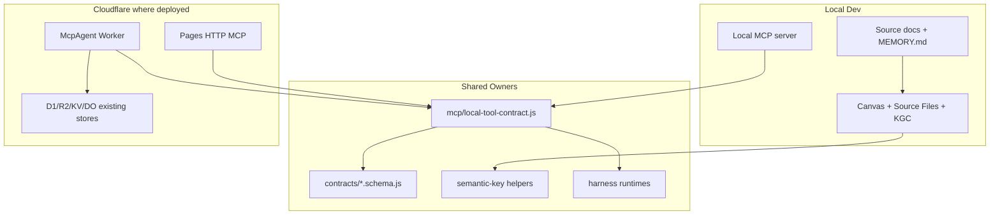

# Knowgrph Runtime-Ready Agentic Canvas OS PRD/TAD

## Scope

Make `knowgrph` a runtime-ready Agentic Canvas OS: a local-first and Cloudflare-ready control plane for discovering, orchestrating, observing, validating, and rendering AI harness work through Canvas.

This contract consolidates the native-in-repo direction: no new Vercel, AWS, Supabase, dashboard-only graph store, or browser-secret surface. Superseded connector topology remains reference material only.

## PRD

### Problem

`knowgrph` already has multiple AI and automation harnesses, but runtime state, tool discovery, approvals, cost logs, and proof paths are distributed across local MCP tools, source documents, Canvas views, and Worker surfaces. A solo operator needs one Agentic Canvas OS contract that makes those capabilities discoverable, inspectable, and runnable without introducing a second runtime.

### Personas

| Persona | Need | Success |
|---|---|---|
| Operator | Know what can run, what is running, what costs money, and what needs approval | One discovery/readiness path answers before action. |
| External agent | Discover tools and constraints without scraping UI or spending tokens | MCP discovery returns typed capabilities and boundaries. |
| Solo founder | Turn source-backed goals into runnable artifacts, dashboards, and demos | A local dry-run can become runtime-ready with focused proof. |
| Maintainer | Avoid drift, hardcodes, and duplicate owners | Shared contracts own behavior; docs name owners and VCCs. |

### User Stories

| Story | Acceptance | Priority |
|---|---|---|
| Discover OS capabilities | Given an MCP client, when it calls the capabilities view, then it receives a deduplicated tool catalog with source catalogs and no model spend. | Must |
| Inspect runtime state | Given existing harness state, when the process view runs, then readable runs appear with normalized identity, native status, source reference, and unavailable sources listed. | Must |
| Observe spend and gates | Given AI or paid-capable harnesses, when cost and gate views run, then cost logs, approval gates, and coverage gaps are visible without mutation. | Must |
| Run approval-gated workflows | Given a supported Director or harness, when a run is requested without approval, then the run blocks with zero paid calls; with valid approval, it emits typed artifacts and cost logs. | Must |
| Render Canvas dashboards | Given a typed run manifest or source-backed document, when Canvas opens it, then existing Source Files, frontmatter, KGC, and Storyboard owners render the state without a dashboard-only renderer. | Should |
| Prove runtime readiness | Given a capability marked runtime-ready, when validation runs, then its VCCs surface parse, route, execute, cost, bound, and deploy-boundary proof. | Must |

### Success Metrics

| Metric | Target |
|---|---:|
| Discovery token spend | 0 |
| New persistent OS datastore | 0 |
| Browser-stored provider secrets | 0 |
| Unapproved paid calls, payment actions, or deploys | 0 |
| Agentic loop without max iteration and circuit breaker | 0 |
| Runtime-ready claims without surfaced VCC proof | 0 |
| Capability catalogs requiring duplicate manual lookup | 0 |
| Files over local hygiene budget in this doc set | 0 |

### MoSCoW

| Tier | Scope |
|---|---|
| Must | MCP discovery, OS status read views, local harness contracts, cost logs, approval gates, VCCs, Dev-only deploy guard. |
| Should | Canvas dashboard projection, live control-plane Worker parity where already deployed, demo pack assembly, operator-friendly validation runbook. |
| Could | Additional provider adapters, richer run history, dashboard comparison, deploy proof after explicit approval. |
| Won't | New dashboard datastore, Vercel/AWS product tier, browser-owned secrets, compatibility aliases, unbounded loops, direct downstream patches. |

## TAD

### Architecture

### Component Inventory

| Component | Responsibility | Owner direction |
|---|---|---|
| Agentic OS memory | Local route, tag, binding, gate, and deploy-boundary seed | `agentic-os-docs/MEMORY.md` |
| Agent instructions | Editing and validation rules for this folder | `agentic-os-docs/AGENTS.md` |
| OS status tool | Read-only process, capability, cost, gate, and circuit-breaker views | Existing `knowgrph` MCP/runtime owners |
| Capability registry | Deduplicate tool catalogs and report unreachable optional catalogs | Shared MCP catalog owners |
| Harness catalog | Define typed input/output/cost/fallback/bound contracts | Existing harness runtimes and contracts |
| Canvas dashboard | Render source-backed runtime state | Source Files, KGC/frontmatter, Storyboard owners |
| Control-plane MCP | Remote approval-gated orchestration where deployed | Cloudflare McpAgent Worker owners |

### Runtime Gates

| Gate | Runtime-ready condition |
|---|---|
| Parse | Frontmatter parses without repair fallback. |
| Route | `/`, `#`, and `@` resolve through existing utilities or return structured errors. |
| Execute | Harness input and output schemas validate. |
| Cost | Every model-bearing path emits cost logs. |
| Bound | Every loop has max iterations and a circuit breaker. |
| Approval | Paid, mutating, payment, and deploy actions require `@operator` approval. |
| Proof | Focused tests or checks are surfaced in the agent output. |

### ADRs

| ADR | Decision | Rationale |
|---|---|---|
| ADR-AOS-1 | Native-in-repo Agentic Canvas OS | Existing `knowgrph` owners already carry Canvas, MCP, source docs, and Cloudflare control plane. |
| ADR-AOS-2 | Discovery-first MCP gateway, no fifth proxy | Avoid duplicated dispatch, latency, schema drift, and cost-accounting split. |
| ADR-AOS-3 | Read-time OS aggregation, no new datastore | Keeps TCO at zero and avoids stale OS-level copies. |
| ADR-AOS-4 | Dev-only until explicit deploy approval | Prevents accidental Prod mirror or Cloudflare mutation. |

## VCCs

| VCC | Proof |
|---|---|
| Discovery is zero-spend | Capability view returns cost log fields all `0`; no model call traces are emitted. |
| Runtime state is read-only | Before/after diff of harness state sources is empty after status calls. |
| Approval gate blocks spend | Run without approval returns blocked or approval-required state with estimated cost `0`. |
| Canvas dashboard is source-backed | Dashboard opens from Markdown/frontmatter/KGC owners; no dashboard-only graph store exists. |
| Deploy boundary is clean | Worktree shows no Prod mirror mutation and no Cloudflare deploy command was run. |
