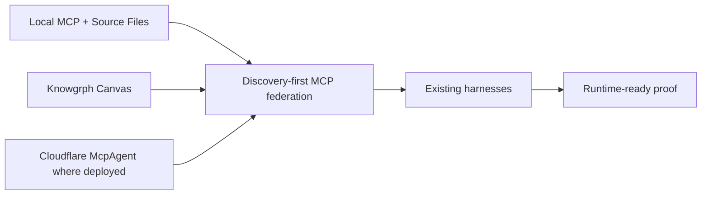

# Knowgrph Agentic Canvas OS Docs

This folder is the local documentation control surface for making `knowgrph` a runtime-ready Agentic Canvas OS. It is not a deploy artifact and does not authorize Prod or Cloudflare mutation.

## Document Map

| File | Role | Use |
|---|---|---|
| `MEMORY.md` | Local memory seed | Source of truth for `/`, `#`, `@`, runtime gates, and deploy boundaries. |
| `AGENTS.md` | Agent instructions | Rules for editing this folder. |
| `DICTIONARY-COMMAND.md` | Slash dictionary | `/` command-route intents, bindings, filters, and VCC signals. |
| `DICTIONARY-SEMANTIC.md` | Hash dictionary | `#` semantic filters for routing, proof, cost, and cleanup. |
| `DICTIONARY-BINDING.md` | At dictionary | `@` actor, source, runtime, proof, and boundary bindings. |
| `PRD-TAD.md` | Combined product and architecture contract | What `knowgrph` must provide and how the runtime is shaped. |
| `RUNTIME-READINESS.md` | Readiness matrix | Tracks spec-complete to runtime-ready gates by capability. |
| `HARNESS-CONTRACTS.md` | Harness contract catalog | Typed AI harness contracts, cost logs, fallback paths, and loop bounds. |
| `MCP-GATEWAY.md` | MCP federation contract | Discovery-first gateway rules across local, Pages, browser, and control-plane surfaces. |
| `VALIDATION-RUNBOOK.md` | Focused proof lane | Commands and checks for documentation, local runtime, and deploy guards. |

## Runtime Position

`knowgrph` is the Agentic Canvas OS when these contracts are true:

- A caller can discover capabilities without paid model calls.
- A caller can inspect process, cost, gate, and circuit-breaker state through typed read views.
- A caller can run approval-gated agent workflows through shared local or control-plane MCP owners.
- AI stages are harnessed with typed inputs, typed outputs, cost logs, fallback paths, and bounded loops.
- Canvas renders source-backed dashboards through existing Markdown, frontmatter, KGC, Source Files, and Storyboard owners.
- Dev, Prod mirror, and Cloudflare state remain separate unless the operator explicitly opens the deploy gate.

## Topology Boundary

The current native-in-repo target is:

Superseded Vercel/AWS connector lanes are historical reference only unless a later ADR reopens them with a separate TCO and deployment-model comparison. The active runtime-ready path is `knowgrph` local + Cloudflare control-plane owners.

## Operating Rule

Use the smallest doc or runtime change that makes the capability truthful. If a claim cannot be proven by a VCC, keep it as `spec-complete` rather than `runtime-ready`.
