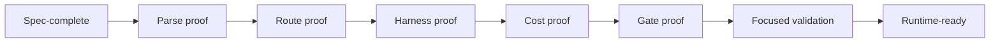

# Runtime Readiness

Runtime-ready means the claim can be proven from surfaced output. Spec-complete means the contract exists but still needs live or local runtime proof.

## Readiness Matrix

| Capability | Current target | Runtime-ready proof | Status |
|---|---|---|---|
| Agent instructions | Local docs obey `AGENTS.md` and `MEMORY.md` | `AGENTS.md` and `MEMORY.md` exist, are readable, and direct Dev-only operation | Runtime-ready for docs |
| Capability discovery | External and local agents discover tools without model spend | MCP/local catalog check exits 0; response includes deduplicated tool ids and zero cost | Spec-complete here; prove in `knowgrph` |
| OS process view | Operator sees readable harness state sources | Status call returns normalized entries and `unavailableSources[]` without mutation | Spec-complete here; prove in `knowgrph` |
| Cost summary | Operator sees cost and token accounting | Cost logs validate against schema; model-free views report exact zero | Spec-complete here; prove in `knowgrph` |
| Gate catalog | Operator sees approval boundaries | Canonical gates are listed; reads do not issue or consume tokens | Spec-complete here; prove in `knowgrph` |
| Circuit breakers | Operator sees max iterations and current counts | Registry returns each bounded loop; no loop lacks max iteration and circuit breaker | Spec-complete here; prove in `knowgrph` |
| Video Remix Director | Source-backed agent workflow can block or run with approvals | Missing approval yields zero-cost blocked state; approved dry-run emits storyboard/render evidence | Memory-derived; verify current local owner before marking runtime-ready |
| Canvas dashboard | Runtime state projects through existing Canvas owners | Markdown/frontmatter/KGC document renders without dashboard-only graph store | Spec-complete here; prove in local Canvas |
| Cloudflare control-plane MCP | Remote orchestration where deployed | Worker tool list and run endpoints pass focused checks after explicit deploy approval | Gated; not executed from this doc set |

## Spec-Complete Checklist

- [ ] Frontmatter identity is present.
- [ ] Source of truth is named.
- [ ] User problem and target persona are explicit.
- [ ] Acceptance criteria are VCC-translatable.
- [ ] Token budget and monthly TCO are stated.
- [ ] FOSS or existing-owner alternative is named before new dependency.
- [ ] Harness input/output/fallback/cost/bound contract is stated.
- [ ] Deployment boundary is split into Dev, Prod mirror, and Cloudflare.

## Runtime-Ready Checklist

- [ ] Parse proof surfaced.
- [ ] Route proof surfaced.
- [ ] Schema validation proof surfaced.
- [ ] Cost log proof surfaced.
- [ ] Circuit-breaker proof surfaced.
- [ ] Approval-gate proof surfaced.
- [ ] Focused tests or checks exited 0.
- [ ] No unintended state mutation occurred.
- [ ] No Prod mirror or Cloudflare deploy occurred without approval.

## Readiness Flow

## Status Rules

| Label | Meaning |
|---|---|
| `draft` | Authored but incomplete. |
| `spec-complete` | Contract is complete enough to implement or verify. |
| `runtime-ready` | Focused VCC proof was surfaced in the current runtime. |
| `gated` | Requires operator approval, credentials, paid call, Prod mirror, or Cloudflare action. |
| `blocked` | Cannot advance without missing source, owner, or approval. |

Never promote a capability to `runtime-ready` from prose alone.
