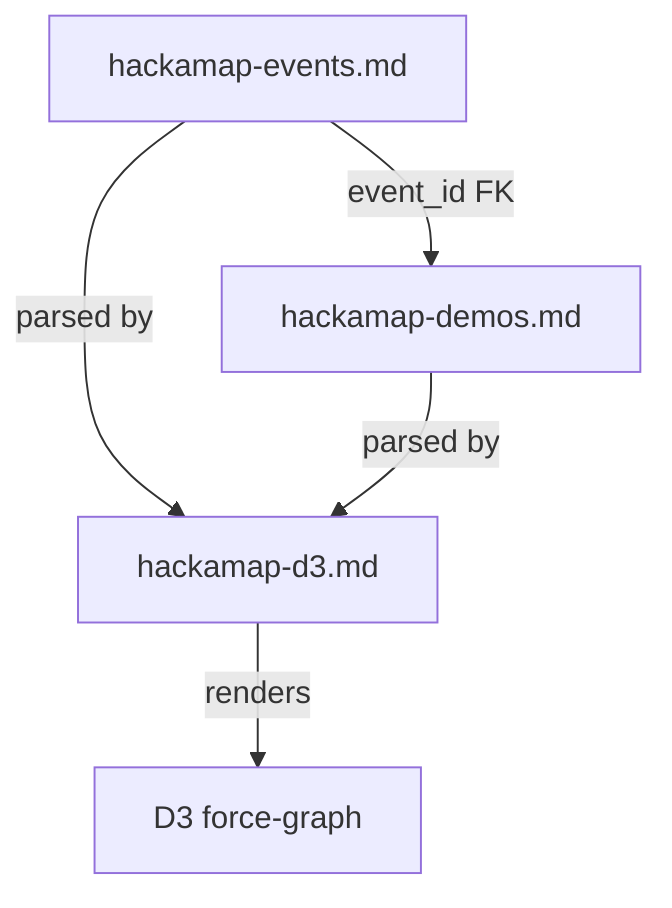

# hackamap.md
# Orchestration index — hackamap-events.md · hackamap-demos.md · D3 graph

---

## Purpose

Single source of truth linking the two data files, defining their shared
contracts, and feeding the D3 force-graph scaffold in hackamap-d3.md.

---

## File registry

| File | Role | Primary key | Links to |
|---|---|---|---|
| `hackamap-events.md` | One row per hackathon event | `id` e.g. `evt-001` | — |
| `hackamap-demos.md` | One row per demo or project | `id` e.g. `demo-001` | `event_id → evt-xxx` |
| `hackamap-d3.md` | D3 graph scaffold spec | — | both files above |

---

## Data flow

---

## hackamap-events.md

| id | Event | Organizer | Format | Location | Date Start | Date End | Theme | Prize Pool | Tech Focus | Eligibility | URL | Source Type | Confidence | Extracted At |
|---|---|---|---|---|---|---|---|---|---|---|---|---|---|---|
| `evt-001` | IBM x UNSA Hackathon | `["IBM Z","UNSA Sheridan"]` | online | Online | 2026-05-08 | 2026-05-10 | UN SDGs; AI for good | TBD | `["IBM Z","cloud (unspecified)","AI tools (unspecified)"]` | `["global students"]` | `["https://ibm-unsa-hackathon.devpost.com/"]` | `["devpost","event-page"]` | high | 2026-04-04 |
| `evt-002` | MY AI Video Hackathon | `["BytePlus","Building with AI"]` | in-person | Malaysia | 2026-03-01 | 2026-03-01 | AI video; media production | TBD | `["Seedance model","ModelArk"]` | `["local MY creators"]` | `["https://x.com/BytePlusGlobal/status/2039621356195586166"]` | `["twitter","marketing"]` | low | 2026-04-04 |

---

## hackamap-demos.md

| id | event_id | Pain Point | Solution | Product | Team | Tech Stack | Demo URL | Repo URL | Video URL | Award | Source Type | Confidence | Extracted At |
|---|---|---|---|---|---|---|---|---|---|---|---|---|---|
| `demo-001` | `evt-001` | global students need accessible venue to build AI solutions aligned to UN SDGs | 3-day virtual hackathon; submission requires repo and 2–3 min demo video | `["AI prototypes","demo videos"]` | `["IBM Z Sheridan","UNSA Sheridan"]` | `["AI tools (unspecified)","IBM Z + cloud (mentioned)"]` | `["https://ibm-unsa-hackathon.devpost.com/"]` | TBD | TBD | TBD | `["devpost","event-page"]` | high | 2026-04-04 |
| `demo-002` | `evt-002` | content creators lack cinematic video production tools; high barrier to media production | AI-generated video from text and image input | `["text-to-video","image-to-video","cinematic output"]` | `["Building with AI community","local MY creators"]` | `["Seedance model","ModelArk"]` | TBD | TBD | TBD | TBD | `["twitter","marketing"]` | low | 2026-04-04 |

---

## D3 graph interlinking contract

### Node types

| Node type | Source file | Source column | D3 color | Radius |
|---|---|---|---|---|
| Event | `hackamap-events.md` | `Event` | teal | 22 |
| Demo | `hackamap-demos.md` | `id` | purple | 16 |
| Tech | both | `Tech Focus`; `Tech Stack` | gray | 10 |
| Team | both | `Organizer`; `Team` | coral | 12 |
| Pain Point | `hackamap-demos.md` | `Pain Point` | pink | 11 |
| Product | `hackamap-demos.md` | `Product` | blue | 10 |
| Location | `hackamap-events.md` | `Location` | green | 10 |
| Audience | `hackamap-events.md` | `Eligibility` | amber | 10 |

### Edge types

| Edge label | Source node | Target node | Trigger |
|---|---|---|---|
| `has_demo` | Event | Demo | `demo.event_id === event.id` |
| `organized_by` | Event | Team | `events[Organizer]` items |
| `focuses_on` | Event | Tech | `events[Tech Focus]` items |
| `held_at` | Event | Location | `events[Location]` scalar |
| `targets` | Event | Audience | `events[Eligibility]` items |
| `uses` | Demo | Tech | `demos[Tech Stack]` items |
| `built_by` | Demo | Team | `demos[Team]` items |
| `addresses` | Demo | Pain Point | `demos[Pain Point]` prose |
| `produces` | Demo | Product | `demos[Product]` items |

### Live edge map — current data

| Source id | Source label | Target label | Edge label |
|---|---|---|---|
| `evt-001` | IBM x UNSA Hackathon | demo-001 | `has_demo` |
| `evt-002` | MY AI Video Hackathon | demo-002 | `has_demo` |
| `evt-001` | IBM x UNSA Hackathon | IBM Z | `organized_by` |
| `evt-001` | IBM x UNSA Hackathon | UNSA Sheridan | `organized_by` |
| `evt-002` | MY AI Video Hackathon | BytePlus | `organized_by` |
| `evt-002` | MY AI Video Hackathon | Building with AI | `organized_by` |
| `evt-001` | IBM x UNSA Hackathon | IBM Z | `focuses_on` |
| `evt-001` | IBM x UNSA Hackathon | cloud (unspecified) | `focuses_on` |
| `evt-001` | IBM x UNSA Hackathon | AI tools (unspecified) | `focuses_on` |
| `evt-002` | MY AI Video Hackathon | Seedance model | `focuses_on` |
| `evt-002` | MY AI Video Hackathon | ModelArk | `focuses_on` |
| `evt-001` | IBM x UNSA Hackathon | Online | `held_at` |
| `evt-002` | MY AI Video Hackathon | Malaysia | `held_at` |
| `evt-001` | IBM x UNSA Hackathon | global students | `targets` |
| `evt-002` | MY AI Video Hackathon | local MY creators | `targets` |
| `demo-001` | demo-001 | AI tools (unspecified) | `uses` |
| `demo-001` | demo-001 | IBM Z + cloud (mentioned) | `uses` |
| `demo-002` | demo-002 | Seedance model | `uses` |
| `demo-002` | demo-002 | ModelArk | `uses` |
| `demo-001` | demo-001 | IBM Z Sheridan | `built_by` |
| `demo-001` | demo-001 | UNSA Sheridan | `built_by` |
| `demo-002` | demo-002 | Building with AI community | `built_by` |
| `demo-002` | demo-002 | local MY creators | `built_by` |
| `demo-001` | demo-001 | global students need accessible venue to build AI solutions aligned to UN SDGs | `addresses` |
| `demo-002` | demo-002 | content creators lack cinematic video production tools; high barrier to media production | `addresses` |
| `demo-001` | demo-001 | AI prototypes | `produces` |
| `demo-001` | demo-001 | demo videos | `produces` |
| `demo-002` | demo-002 | text-to-video | `produces` |
| `demo-002` | demo-002 | image-to-video | `produces` |
| `demo-002` | demo-002 | cinematic output | `produces` |

### Shared node deduplication — current data

Same label + same type → single node; multiple edges in. This is where cross-event clustering surfaces.

| Shared node label | Type | Appears in |
|---|---|---|
| Seedance model | Tech | `evt-002` (focuses_on) · `demo-002` (uses) |
| ModelArk | Tech | `evt-002` (focuses_on) · `demo-002` (uses) |
| Building with AI | Team | `evt-002` (organized_by) · `demo-002` (built_by) |
| local MY creators | Audience / Team | `evt-002` (targets) · `demo-002` (built_by) |
| IBM Z | Tech / Team | `evt-001` (focuses_on + organized_by) · `demo-001` (uses) |
| UNSA Sheridan | Team | `evt-001` (organized_by) · `demo-001` (built_by) |

---

## Shared cell conventions

| Convention | Symbol | Parse rule | Example |
|---|---|---|---|
| Multi-select array | `` `["A","B"]` `` | JSON.parse after stripping backticks | `` `["Seedance","ModelArk"]` `` |
| Prose scalar | plain text | never split on `,` or `;` | content creators lack cinematic tools; high barrier to media production |
| Empty / unknown | `TBD` | omit node; do not render | TBD |
| Null / not applicable | `—` | omit node; do not render | — |
| Date scalar | `YYYY-MM-DD` | ISO 8601; two columns for range | 2026-05-08 |
| Confidence | `low` / `medium` / `high` | maps to dashed / partial / solid stroke | high |

---

## Column type map

### hackamap-events.md

| Column | Cell type | Explode to node? | Node type |
|---|---|---|---|
| `id` | scalar | no — primary key | — |
| `Event` | prose | yes | Event |
| `Organizer` | `` `[]` `` array | yes | Team |
| `Format` | prose | no — attribute | — |
| `Location` | prose | yes | Location |
| `Date Start` | scalar | no — attribute | — |
| `Date End` | scalar | no — attribute | — |
| `Theme` | prose | no — attribute | — |
| `Prize Pool` | prose | no — attribute | — |
| `Tech Focus` | `` `[]` `` array | yes | Tech |
| `Eligibility` | `` `[]` `` array | yes | Audience |
| `URL` | `` `[]` `` array | no — attribute | — |
| `Source Type` | `` `[]` `` array | no — attribute | — |
| `Confidence` | scalar | no — attribute | — |
| `Extracted At` | scalar | no — attribute | — |

### hackamap-demos.md

| Column | Cell type | Explode to node? | Node type |
|---|---|---|---|
| `id` | scalar | no — primary key | — |
| `event_id` | scalar | no — FK edge only | — |
| `Pain Point` | prose | yes | Pain Point |
| `Solution` | prose | no — attribute | — |
| `Product` | `` `[]` `` array | yes | Product |
| `Team` | `` `[]` `` array | yes | Team |
| `Tech Stack` | `` `[]` `` array | yes | Tech |
| `Demo URL` | prose | no — attribute | — |
| `Repo URL` | prose | no — attribute | — |
| `Video URL` | prose | no — attribute | — |
| `Award` | prose | no — attribute | — |
| `Source Type` | `` `[]` `` array | no — attribute | — |
| `Confidence` | scalar | no — attribute | — |
| `Extracted At` | scalar | no — attribute | — |

---

## Confidence visual encoding

| Value | Node stroke | Opacity |
|---|---|---|
| `high` | solid | 1.0 |
| `medium` | solid | 0.7 |
| `low` | dashed | 0.5 |
| `TBD` | omit node entirely | — |

---

## Extension placeholders

| Placeholder field | File | Purpose |
|---|---|---|
| `Award` | `hackamap-demos.md` | winner clustering |
| `Prize Pool` | `hackamap-events.md` | sponsor node weight |
| `Video URL` | `hackamap-demos.md` | link-out on Demo node |
| `Repo URL` | `hackamap-demos.md` | link-out on Demo node |
| `Region` | `hackamap-events.md` | geographic clustering |
| `SDG Tags` | `hackamap-demos.md` | UN goal alignment layer |
| `PMF Score` | `hackamap-demos.md` | Hackamap voxel layer hook |
