# Knowgrph Gantt-Timeline Demo

## Response

Canvas `2D Renderer: Gantt-timeline`, BottomPanel `Gantt-Timeline`, and FloatingPanel `Gantt-Timeline` read the same typed Mermaid Gantt source from frontmatter.

The chart uses `HH:mm` task timing, `%H:%M` axis labels, and vertical marker rows so selection can move through the same shared row-key state across all three surfaces.

## Dynamic Input Tokens

- `dateFormat`: `HH:mm`
- `axisFormat`: `%H:%M`
- `initial_marker`: `Initial vert`
- `task_a`: `Task A`
- `task_b`: `Task B`
- `final_marker`: `Final vert`

## Mermaid Source

```mermaid
gantt
    dateFormat HH:mm
    axisFormat %H:%M
    Initial vert : vert, v1, 17:30, 2m
    Task A : 3m
    Task B : 8m
    Final vert : vert, v2, 17:58, 4m
```

