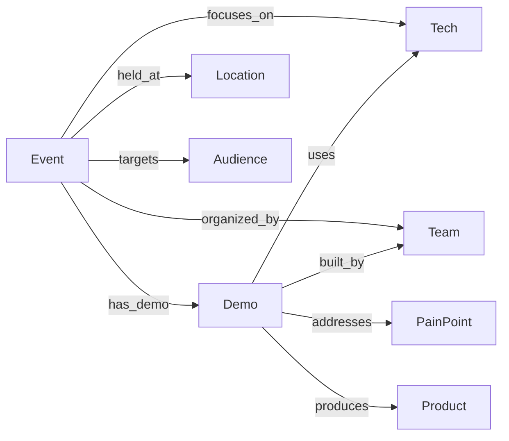

# HackaMap — Knowledge Graph

## Authoring Contract

- The opening YAML frontmatter block remains the first-block machine SSOT for renderer activation, table-mode metadata, and graph-seeding configuration.
- This document is a canonical authored graph/table demo, not a typed normalization fixture.
- Frontmatter stays in plain YAML so the file demonstrates the default authoring path for graph demos, table-backed docs, and seeded D3 views.
- If typed `{key, type, value}` envelopes are needed for ingestion-regression coverage, that validation should live in a dedicated fixture doc rather than replacing the canonical HackaMap example.
- Runtime behavior must still be derived from parsed frontmatter and graph content only, never from file path assumptions or hardcoded demo fallbacks.

Interactive knowledge graph of hackathon events, demos, teams, and technologies. Full dataset: `hackamap/content/events.md` + `hackamap/content/demos.md`.

---

## Editor Workspace

| Setting | Value | Purpose |
|---|---|---|
| Surface Mode | `2d` | Flat SVG canvas (not 3D/voxel) |
| Render Mode | `2d` | 2D rendering pipeline |
| 2D Renderer | `d3` | Force-directed D3 graph layout |
| Semantic Mode | `document` | Markdown tables → graph nodes/edges |
| Frontmatter Mode | `enabled` | `index.mermaid` seeds graph topology |
| Multi-Dim Table | `enabled` | Tables render as interactive data grid |
| Structure Lock | `false` | Allow document structure re-derivation |

---

## View Settings

| Panel | Setting | Recommended Value | Effect |
|---|---|---|---|
| Settings → Canvas | `canvasRenderMode` | `2d` | Flat SVG rendering |
| Settings → Canvas | `graph.behavior.selectMode` | `multi` | Select multiple nodes for cluster inspection |
| Settings → Canvas | `graph.behavior.hover.content.type` | `true` | Show node type in hover tooltip |
| Settings → Canvas | `graph.behavior.hover.content.properties` | `true` | Show node properties in hover tooltip |
| Settings → Rendering | `schema.layout.edges.type` | `bezier` | Curved edges for readability |
| Settings → Rendering | `schema.layout.edges.opacity` | `0.6` | Semi-transparent edges reduce visual clutter |
| Settings → Rendering | `schema.layout.edges.opacityUnderGroups` | `0.45` | Further dim edges inside collapsed groups |
| Settings → Performance | `fitToScreenMode` | `true` | Auto-fit graph on load |

---

## Properties — Node Visual Mapping

| Node Type | Fill Color | Shape | Radius | Stroke | Description |
|---|---|---|---|---|---|
| Event | `#1a6fa8` blue | circle | 12 | `#154f7a` | Hackathon event container |
| Demo | `#28A745` green | circle | 10 | `#1e7e34` | Project / submission / prototype |
| PainPoint | `#DC3545` red | diamond | 8 | `#a71d2a` | Unmet need / problem addressed by demo |
| Product | `#7d3c98` purple | rect | 9 | `#5b2c6f` | Output / deliverable / artifact |
| Team | `#1e8449` green | circle | 8 | `#145a32` | Builder group / organization |
| Tech | `#d68910` amber | hex | 7 | `#9a6301` | Technology / tool / platform |
| Organizer | `#117a65` teal | circle | 8 | `#0e6655` | Event host / sponsor |
| Location | `#5d6d7e` grey | circle | 7 | `#424f5c` | Geographic venue |
| Audience | `#e67e22` orange | circle | 6 | `#b35900` | Target participant segment (schema-only) |
| Source | `#85929e` silver | circle | 5 | `#5d6d7e` | Reference URL / content origin |
| Domain | `#aab7b8` light-grey | circle | 5 | `#808b8d` | Internet domain (schema-only) |
| Platform | `#2e86c1` steel-blue | circle | 6 | `#1a5276` | Social / hosting platform (schema-only) |
| SourceType | `#bb8fce` lavender | circle | 5 | `#8e44ad` | Content classification tag (schema-only) |

### PainPoint → Demo → Product Cluster Pattern

The primary visualization pattern groups around **Demo** nodes as the central hub:

```
Event ──has_demo──▶ Demo ──addresses──▶ PainPoint
                    │
                    ├──built_by──▶ Team
                    ├──uses──────▶ Tech
                    └──produces──▶ Product
```

**Recommended cluster inspection**: Select a Demo node → expand neighbors to reveal the PainPoint it addresses and the Product it produces.

---

## Properties — Edge Visual Mapping

| Edge Label | Color | Width | Style | Arrow | Description |
|---|---|---|---|---|---|
| `has_demo` | `#2980b9` | 2px | solid | yes | Event contains demo |
| `organized_by` | `#117a65` | 1.5px | solid | yes | Event run by organizer |
| `focuses_on` | `#d68910` | 1.5px | solid | yes | Event tech theme |
| `held_at` | `#5d6d7e` | 1px | solid | yes | Event venue |
| `targets` | `#e67e22` | 1px | solid | yes | Event audience (schema-only) |
| `uses` | `#d68910` | 1.5px | solid | yes | Demo tech stack |
| `built_by` | `#1e8449` | 1.5px | solid | yes | Demo team |
| `addresses` | `#DC3545` | 2px | dashed | yes | Demo solves pain point |
| `produces` | `#7d3c98` | 1.5px | solid | yes | Demo creates product |
| `sourced_from` | `#85929e` | 1px | dotted | yes | Entity references source |
| `has_domain` | `#aab7b8` | 1px | dotted | no | Source domain (schema-only) |
| `hosted_on` | `#2e86c1` | 1px | dotted | no | Source platform (schema-only) |
| `classified_as` | `#bb8fce` | 1px | dotted | no | Source type tag (schema-only) |

---

## Graph Stats

| Metric | Value |
|---|---|
| Events | Derived at runtime from `hackamap/content/events.md` |
| Demos | Derived at runtime from `hackamap/content/demos.md` |
| Date range | Derived from source table rows |
| Confidence: high | Devpost event pages |
| Confidence: medium | LinkedIn / community posts |
| Confidence: low | Marketing / announcement posts |
| Full graph fixture | Derived artifact from canonical source tables |

---

## Data Model



---

## Top Events

| id | Event | Location | Date | Tech Focus | Confidence |
|---|---|---|---|---|---|
| evt-001 | IBM x UNSA Hackathon | Online | 2026-05-08 | IBM Z, AI tools | high |
| evt-002 | MY AI Video Hackathon | Malaysia | 2026-04-02 | Seedance, ModelArk | low |
| evt-003 | TinyFish Web Agent Hackathon | Singapore | — | TinyFish web agents, OpenAI | medium |
| evt-004 | GitLab AI Hackathon | Online | 2026-03-25 | GitLab workflows | medium |
| evt-005 | AI filmmaking @ SXSW | Austin, TX | 2026-03-17 | KoyalAI | medium |
| evt-006 | Hack AI 2026 | Richardson, TX | 2026-03-07 | Devpost | high |
| evt-007 | Codex Hackathon | Singapore | 2026-03-03 | Codex, ARKit | low |
| evt-008 | Codex Hackathon APAC | Singapore | 2026-03-03 | Codex | medium |
| evt-009 | OpenClaw Hackathon | Singapore | 2026-03-01 | OpenClaw, agent frameworks | medium |
| evt-010 | AI Tinkerers Hackathon | Singapore | 2026-02-22 | AI agents, LLMs | medium |

## Top Demos

| id | Event | Team | Tech Stack | Product |
|---|---|---|---|---|
| demo-001 | IBM x UNSA | IBM Z Sheridan | AI tools, IBM Z | AI prototypes |
| demo-002 | MY AI Video | Building with AI | Seedance, ModelArk | text-to-video |
| demo-003 | TinyFish Web Agent | TinyFish, NUS | TinyFish web agents | autonomous web-agent demos |
| demo-004 | GitLab AI | Devpost, GitLab | GitLab workflows | AI agents for SDLC |
| demo-005 | SXSW Filmmaking | KoyalAI | KoyalAI | AI filmmaking tool |
| demo-006 | Hack AI 2026 | Hack AI organizers | Devpost | winner project gallery |
| demo-007 | Codex SG | OpenAI community | Codex, ARKit | rapid prototyping |
| demo-008 | Codex APAC | OpenAI Developers | Codex | agentic coding |
| demo-009 | OpenClaw | OpenClaw community | OpenClaw, agent frameworks | agent demos |
| demo-010 | AI Tinkerers | AI Tinkerers SG | AI agents, LLMs | agent prototypes |

---

## Full Dataset

Browse the complete dataset in the `hackamap/content/` directory:

| File | Rows | Content |
|---|---|---|
| `hackamap/content/events.md` | 141 | All hackathon events |
| `hackamap/content/demos.md` | 142 | All demos and projects |
| `hackamap/content/sources.md` | 322 | Derived: canonical URLs |
| `hackamap/content/organizer.md` | 229 | Derived: organizer index |
| `hackamap/content/team.md` | 228 | Derived: team index |
| `hackamap/content/techstack.md` | 165 | Derived: technology index |
| `hackamap/content/hackamap-prd-tad.md` | — | PRD, TAD, and pipeline operations |
| `hackamap/content/hackamap-d3.md` | — | D3 graph scaffold spec |
