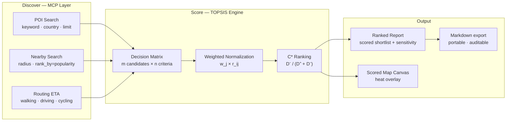
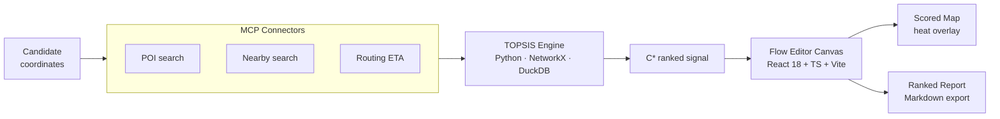

# Knowgrph

**Candidates in. Ranked decisions out.** A knowledge graph canvas that calls live map APIs via MCP tools, scores every candidate location through a TOPSIS multi-criteria engine, and delivers a portable, auditable site selection report — in minutes, not weeks.

> Not a dashboard. A decision pipeline.

---

## The problem — location decisions are still spreadsheets

Opening a cafe, placing a retail pop-up, entering a new market. The question is always the same: *which location?* The answer is almost always the same process: someone opens a spreadsheet, pastes in addresses, drives around, argues from gut feel, picks.

| | Status quo | Knowgrph |
|---|---|---|
| **Data freshness** | Offline reports, last-year surveys | Live POI density via MCP API calls |
| **Competition analysis** | Manual Google Maps tab-switching | `nearby_search` → competitor count per radius |
| **Routing / accessibility** | Estimated or ignored | `navigation` ETA — walking · driving · cycling |
| **Scoring model** | Gut feel, no audit trail | TOPSIS C* — weighted, normalized, reproducible |
| **Time per candidate** | 2–4 hours | Seconds per API call |
| **Output** | PowerPoint with vibes | Ranked Markdown report · scored map canvas |

The analyst time cost is real. The opacity is the bigger problem — a site pick that can't be interrogated can't be improved.

**Knowgrph makes location intelligence reproducible, live, and legible.**

---

## Who it's for

The ICP is not an industry. It's a decision type: **anyone shortlisting physical locations who needs scored, evidence-based output faster than a traditional market study allows.**

This person operates in:

- **F&B expansion** — franchise operators, independent restaurant groups, cloud kitchen networks opening outlet #2 to #10
- **Retail / pop-up brands** — DTC brands, seasonal activations, market stall operators choosing between 5–20 viable sites
- **Property development** — developers benchmarking commercial lots; landlords advising anchor tenant fit
- **Management consulting** — market entry advisory, retail network optimisation, competitor gap analysis across city districts

They share one bottleneck: **too many candidates, not enough scored data, not enough time.**

Markets where the gap is sharpest — Southeast Asia (SG MY TH ID PH VN), MENA (AE SA EG), South Asia (IN BD), Latin America (MX BR CO) — have high physical retail density, fragmented POI data, and no local equivalent of a mature market research platform.

---

## The insight — APIs already know

Maps platforms index millions of POIs, update in near-real-time, and expose everything needed for a rigorous site evaluation: competitor counts, category density, footfall proxies, transit ETAs across walking, driving, and cycling profiles.

None of that requires a field visit. It requires a pipeline.

```
candidate coordinates
→ MCP: POST nearby_search       → competitor count + F&B density
→ MCP: GET /place/v2/nearby     → residential + retail + commercial POI count
→ MCP: POST navigation          → walking ETA to transit · driving ETA to centre
→ TOPSIS: normalize · weight    → C* score per candidate
→ output: ranked report         → top 3 with sensitivity analysis
```

Swap a weight. All scores recompute. Same reproducibility as code.

---

## What it does



### Criteria the pipeline measures

| ID | Criterion | MCP Endpoint | Direction | Weight (default) |
|----|-----------|-------------|-----------|-----------------|
| C1 | Competitor density (2.5 km) | `POST nearby_search` | Lower = better | 0.25 |
| C2 | F&B / category saturation | `GET /place/v2/nearby` | Lower = better | 0.10 |
| C3 | Residential POI count | `GET /place/v2/nearby` | Higher = better | 0.15 |
| C4 | Retail / mall POI count | `GET /place/v2/nearby` | Higher = better | 0.10 |
| C5 | Walk-to-transit ETA (min) | `POST navigation profile=walking` | Lower = better | 0.15 |
| C6 | Drive-to-centre ETA (min) | `POST navigation profile=driving` | Target range | 0.05 |
| C7 | Total area POI density | `GET /poi/v1/search` | Higher = better | 0.10 |
| C8 | Commercial building count | `GET /place/v2/nearby` | Higher = better | 0.05 |

**Transport profiles:** `walking` · `driving` · `cycling` · `motorcycle` · `tricycle`

All weights are frontmatter fields. Swap one value, all C* scores recompute.

---

## Demo — New Cafe · Singapore · 7 Candidates · 23 API Calls

**Setup:** 7 candidate areas, radius 2.5 km (~30-min walk), ranked by `popularity`. 23 MCP calls total across POI search, nearby search, and routing profiles.

### TOPSIS results

| Rank | Location | C* | Decisive signal |
|------|----------|-----|----------------|
| 🥇 1 | **Bukit Panjang** | **0.82** | Zero cafe competitors · Bukit Panjang DTL MRT **16-second walk** · C8=18 commercial buildings (highest) |
| 🥈 2 | **Punggol** | **0.78** | C1=1 (one traditional coffeeshop only) · C3=22 HDB residential POIs · young growing demographic |
| 🥉 3 | **Woodlands** | **0.71** | C1=0 · causeway commuter flow · education/childcare ecosystem → family catchment |
| 4 | Yishun | 0.62 | Northpoint City mall anchor (C4=25) · C1=0 · high F&B saturation (C2=12) offsets |
| 5 | Jurong West | 0.41 | Major transport hub · C2=20 (worst saturation) · longest MRT walk (~14 min) |
| 6 | Sengkang | 0.22 | C1=6 cafes incl. 2 Starbucks · Compass One fully served — **do not enter** |
| — | CBD | 0.09 | Baseline saturation reference only |

### Sensitivity analysis — weight shifts change the winner

| Scenario | Weight change | New winner | Rationale |
|----------|-------------|-----------|-----------|
| Maximise foot traffic | C4 mall → 0.25 | **Yishun** | Northpoint City C4=25 becomes decisive |
| Minimise rent risk | Add C9 rent index → 0.10 | **Woodlands** | Northern areas ~30% below central band |
| Weekday lunch priority | C8 commercial → 0.20 | **Bukit Panjang** | C8=18 (highest) + DTL commuter lunch crowd |
| Family demographic focus | C3 residential → 0.30 | **Punggol** | C3=22 HDB precinct — dominant residential density |
| Hard filter C1 > 2 | Eliminate saturated | **BPJ · Woodlands · Yishun** 3-way tie | MRT access breaks tie → BPJ wins |

---

## Architecture

Server-light. MCP connectors call maps APIs directly. The TOPSIS engine runs in Python. The canvas renders in the browser.



| Layer | Technology |
|---|---|
| MCP connectors | Maps APIs — POI search · nearby · routing ETA (5 transport profiles) |
| Scoring engine | TOPSIS — Python 3.10+ · NetworkX · DuckDB · weighted normalization · C* ranking |
| Frontend canvas | React 18 + TypeScript + Vite 6 · D3.js · Mermaid |
| Map overlay | D3.js / Leaflet — heat scored candidates on base map |
| Local DB | RxDB — offline-first · report versioning |
| Payments | Stripe — per-report + subscription |
| Deployment | Cloudflare Pages (PWA) — airvio.co/knowgrph |

---

## Business model

**Per-report** — pay-per-scored shortlist. Input candidates, receive ranked Markdown report + scored canvas. No subscription required to start.

**Workspace subscription** — unlimited scoring runs, saved canvases, report history, weight model library.

**API tier** — embed the TOPSIS scorer into existing property, F&B, or retail tools via REST. Bring your own geo API keys; Knowgrph handles the scoring logic.

**Advisory** — custom weight models per vertical (F&B vs. retail vs. logistics), calibrated against ground-truth site performance data.

---

## Roadmap

**Now** — MCP pipeline (POI + nearby + routing), TOPSIS scorer, ranked Markdown report, Stripe per-report gating

**Next** — scored map canvas (heat overlay), multi-provider geo adapter (swap maps API without re-wiring scorer), batch candidate import (CSV → N runs), sensitivity dashboard

**Later** — rent-index integration (URA / third-party property data), real-time rescore on candidate edit, collaborative workspace, mobile shortlisting UI

---

## The ask

**Design partners** — F&B operators, retail brands, or property consultants with live site decisions in the next 90 days. We run your shortlist through the pipeline; you validate the C* output against what you know on the ground.

**Geo API access** — teams with maps platform API keys (POI search, nearby, routing ETA) across SEA, MENA, or South Asia markets. Knowgrph is provider-agnostic; the adapter layer handles normalization.

**Ground-truth datasets** — post-opening performance data (revenue, footfall) from sites already chosen by gut feel. We back-test C* predictions against actuals to calibrate weights.

**Distribution intros** — franchise networks, VC portfolio ops teams, property consultancies, and retail expansion advisors who run multiple site decisions per quarter.

If you believe location intelligence should be as reproducible as code — scored, auditable, and re-runnable — let us build it together.

---

**Product:** airvio.co/knowgrph

**Docs:** see `docs/conflict-resolution.md` for repo sync policy.

> *"Map it. Score it. Decide it."*