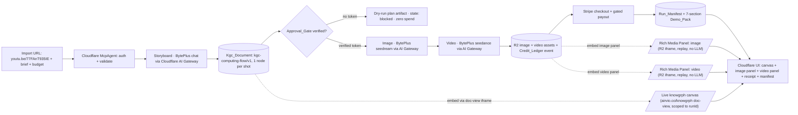
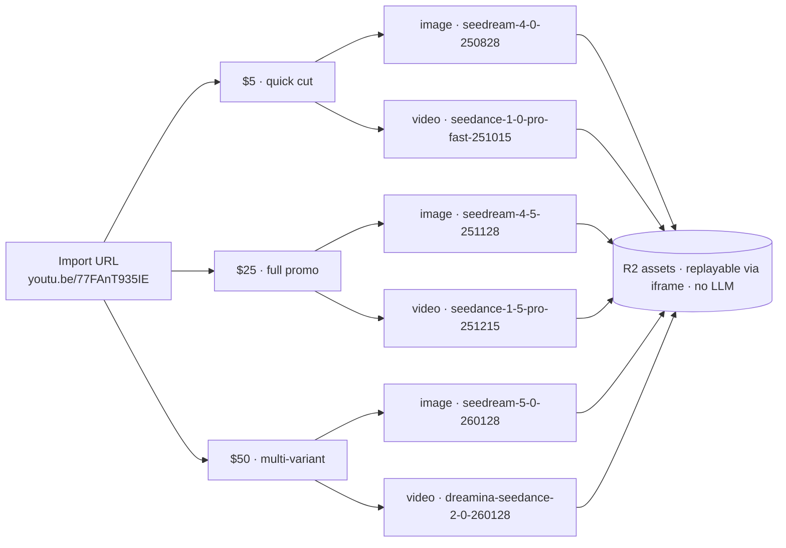
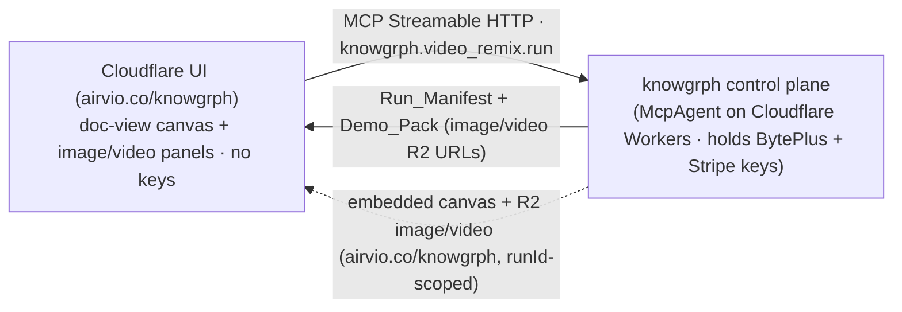

# Knowgrph MCP Agentic Canvas OS — Demo

**Demos:** [`knowgrph-mcp-agentic-canvas-os-prd-tad.md`](knowgrph-mcp-agentic-canvas-os-prd-tad.md)

One autonomous agent takes a **reference video URL + a creative brief + a budget
cap** and drives the full loop — **storyboard → image → video → checkout** —
ending in a **sold, R2-stored remix** with replayable image and video panels.
The whole demo starts from a single **Import URL** field (the walkthrough below
imports the real clip
[`youtu.be/77FAnT935IE`](https://youtu.be/77FAnT935IE)). The default provider is
**BytePlus** (chat `agnes/seed`, image `seedream`, video `seedance`); every
model/media call routes through **Cloudflare AI Gateway** and every spend
boundary is gated by a human approval token. This page is the operator + judge
walkthrough of that flow.

## Current status

- **Truthful state today:** the Cloudflare control plane (Workers `McpAgent` +
  Pages + R2 + AI Gateway) and local contracts already support a high-ROI live
  path. The product runs entirely on **Cloudflare**: `airvio.co/knowgrph` serves
  the UI and the `doc-view` canvas; `airvio.co/knowgrph/mcp` serves the agent
  tools.
- **Default provider:** **BytePlus** (via the BytePlus API key) is the default
  model/media provider for chat, image, and video, routed through **Cloudflare
  AI Gateway** for cache, token counting, fallback, and unified billing.
- **Immediate live-product-ready target:** the in-session flow mints its own
  `Auth_Token`, submits the run, then re-submits the same run with updated
  `approvals[]` after each user decision, and embeds the run-scoped `doc-view`
  canvas plus the image/video Rich Media Panels.

## At a glance

| **Hero tool** | `knowgrph.video_remix.run` (+ stage tools) over MCP Streamable HTTP |
| **Control plane** | Cloudflare Workers `McpAgent` (Agents SDK) at `airvio.co/knowgrph/mcp` — holds all model keys |
| **Product surface** | Cloudflare Pages/Workers at `airvio.co/knowgrph` — UI, `doc-view` canvas, R2 media |
| **Default provider** | **BytePlus** (BytePlus API key): chat `agnes/seed`, image `seedream`, video `seedance` |
| **Model routing** | All model/media calls via **Cloudflare AI Gateway** (cache, token count, fallback, unified billing) |
| **Media + payment** | BytePlus image/video → R2 assets · Stripe checkout/payout |
| **Publish chain** | Dev `knowgrph` → Prod mirror `huijoohwee/content/knowgrph` → Cloudflare `airvio.co/knowgrph` (operator-gated) |
| **Safety** | Dry-run by default; approval gates; single-use 15-min Approval_Tokens; budget meters |
| **Default behavior** | Live mode **without** approvals halts at the first spend gate with **zero** paid actions |

## The hero flow



```mermaid
sequenceDiagram
  actor User
  participant Web as Cloudflare UI (airvio.co/knowgrph)
  participant Mcp as McpAgent (Cloudflare)
  participant Dir as Director Workflow
  participant Gate as HITL Gate
  participant BP as BytePlus via Cloudflare AI Gateway
  participant R2 as Cloudflare R2 + Stripe
  User->>Web: referenceUrl + brief + budget
  Web->>Mcp: POST auth/session + forward knowgrph.video_remix.run (Streamable HTTP)
  Mcp->>Mcp: verify Auth_Token -> Caller_Identity (401 if invalid)
  Mcp->>Dir: start run (mode=live)
  loop each stage storyboard->image->video->checkout
    Dir->>Gate: spend boundary? request Approval_Gate
    alt no verified, unexpired, unconsumed token
      Gate-->>Dir: approval_required
      Dir->>Dir: resolve stage to dry-run plan artifact (zero spend)
    else verified token
      Gate-->>Dir: approved (token marked consumed, single-use)
      Dir->>BP: storyboard (chat) / image (seedream) / video (seedance)
      BP-->>Dir: result or typed degraded error
      Dir->>R2: store image + video assets; create Stripe session
    end
    Dir->>Mcp: persist Run_Manifest (<=2s)
  end
  Dir-->>Mcp: terminal Run_Manifest + Demo_Pack
  Mcp-->>Web: Run_Manifest (image + video R2 URLs)
  Web->>Web: iframe doc-view canvas + iframe R2 image + iframe R2 video (replay, no LLM)
  Web-->>User: canvas + image panel + video panel
```

## Live demo script (operator)

> Endpoints are environment-driven (no hardcoded URLs). The deploy is
> operator-gated behind the `cloud-deploy` Approval_Token — see the
> [deploy runbook](../../knowgrph/docs/knowgrph-acos-deploy-runbook.md).
> All routes are served by **Cloudflare** under `airvio.co/knowgrph` (UI +
> `doc-view`) and `airvio.co/knowgrph/mcp` (agent tools).

### 0. Open a session

```
POST airvio.co/knowgrph/mcp/auth/session     ->  { token }   # Cloudflare McpAgent
```

### 1. Submit the run — and prove it fails safe (AC-1)

```
POST airvio.co/knowgrph/mcp   (tools/call knowgrph.video_remix.run)
Authorization: Bearer <token>
{ "referenceUrl": "https://youtu.be/77FAnT935IE",
  "brief": "Turn this reference clip into a 30s vertical promo.",
  "budgetUsd": 25.00,
  "approvals": [] }
```

**Expected (no approvals):** `state: "blocked"`, `approvalGates.length >= 3`,
`budgetMeters.estimatedCostUsd == 0`, and **zero** BytePlus/Stripe calls logged.
The agent shows the planned stages + budget upfront and stops at the first spend
boundary. *This is the headline safety demo.*

### 2. Approve gates and run the full loop

Approve each spend gate, then **re-submit the same run with updated
`approvals[]`**. The backend already accepts `approvals[]`. The Director now
executes against **BytePlus via Cloudflare AI Gateway**:

1. **Storyboard** — BytePlus chat (`agnes/seed`) via Cloudflare AI Gateway → a
   `kgc-computing-flow/v1` canvas doc with **exactly one node per planned shot**,
   rendered live by **embedding the knowgrph `doc-view` iframe** (the
   `airvio.co/knowgrph` doc-view scoped to this `runId`; reasoning failure falls
   back to a valid single-node plan). knowgrph owns the canvas engine; the UI
   embeds it.
2. **Image** — BytePlus **`seedream`** via Cloudflare AI Gateway → one R2 image
   asset per shot, surfaced in the **Image Rich Media Panel**.
3. **Video** — BytePlus **`seedance`** via Cloudflare AI Gateway → one R2 video
   asset per shot, surfaced in the **Video Rich Media Panel** (keyless /
   over-budget routes to a deterministic zero-spend mock provider). Each
   completed asset writes one Credit_Ledger event.
4. **Checkout** — Stripe checkout session created only when `payment-action` is
   approved; payout settles only after explicit approval.

Once assets exist in R2, the image and video panels **replay from their R2 URLs
via `<iframe>` with zero further LLM/model calls** (see Rich Media Panels below).

### 2b. Same URL, three budgets, six media sub-branches

Keep the imported reference fixed at
[`youtu.be/77FAnT935IE`](https://youtu.be/77FAnT935IE) and vary **only** the
`budgetUsd` dial. The Director reasons about cost-vs-quality and auto-selects the
model tier per cap — **three budget branches**, each fanning into an **image
(`seedream`)** and a **video (`seedance`)** sub-branch: **six media sub-branches
total**, all BytePlus via Cloudflare AI Gateway.



```
POST airvio.co/knowgrph/mcp   # same referenceUrl + brief, different budget
{ "referenceUrl": "https://youtu.be/77FAnT935IE", "brief": "...", "budgetUsd": 5.00,  "approvals": [...] }
{ "referenceUrl": "https://youtu.be/77FAnT935IE", "brief": "...", "budgetUsd": 25.00, "approvals": [...] }
{ "referenceUrl": "https://youtu.be/77FAnT935IE", "brief": "...", "budgetUsd": 50.00, "approvals": [...] }
```

| Budget branch | Image sub-branch (`seedream`) | Video sub-branch (`seedance`) | Shots |
| **$5 — quick cut** | `seedream-4-0-250828` | `seedance-1-0-pro-fast-251015` | ~3 |
| **$25 — full promo** | `seedream-4-5-251128` | `seedance-1-5-pro-251215` | ~6 |
| **$50 — multi-variant** | `seedream-5-0-260128` | `dreamina-seedance-2-0-260128` | ~6 × variants |

Each branch reports a **real per-remix cost** reconciled from the Credit_Ledger
(±0.01 USD) and a Stripe session sized to its tier. The triptych — one source
clip, three budget branches, six BytePlus image/video sub-branches, three real
costs — demonstrates **Autonomy & Decision-Making** (the agent picks the
image+video model per cap) and the TCO / token-economics thesis in one frame.
Over-budget or keyless branches route to the deterministic zero-spend mock
provider, so the comparison is reproducible offline.

### 3. Read back the evidence

```
tools/call response          ->  current Run_Manifest rendered in-session (immediate path)
GET airvio.co/knowgrph/mcp/health ->  200 within 5s (liveness, discloses nothing sensitive)
```

> **Read-back note:** `GET airvio.co/knowgrph/mcp/runs/{id}` is the durable
> manifest read-back path (Workers durable storage / R2) when the same session
> owns the run. The remaining gap is **deployed proof**: capture one live
> end-to-end run showing persisted read-back plus replayed image/video panels.

### 4. One-command reachability gate (AC-8)

```
MCP_ENDPOINT=https://airvio.co/knowgrph/mcp \
FRONTEND_URL=https://airvio.co/knowgrph npm run runtime:verify
```

Probes the `/health`/reachability surfaces (5s-bounded) and emits a sample
`demoPack.urls[]`. Also wired as CI: `.github/workflows/runtime-gate.yml` runs
`runtime:test` + `runtime:verify` on a deploy trigger (endpoints from repo
Variables / dispatch inputs — no hardcode).

## Rich Media Panels — image and video (replay without LLM)

The run surfaces media as **two distinct Rich Media Panels** on the canvas — one
for the BytePlus **image** (`seedream`) and one for the BytePlus **video**
(`seedance`). Both are backed by **Cloudflare R2** asset URLs written during the
run; once written, the panels **replay purely by embedding the R2 URL in an
`<iframe>`/media tag — no model, AI Gateway, or LLM call is made on replay**.
This keeps re-viewing free and instant, and makes the demo reproducible.

| Panel | Source field | BytePlus model | Replay element | Calls LLM on replay? |
| **Image Rich Media Panel** | `imageAssetUrl` (R2) | `seedream` | `<iframe>` / `` | **No** |
| **Video Rich Media Panel** | `videoUrl` (R2) | `seedance` | `<iframe>` / `<video controls>` | **No** |
| Run Dashboard panel | `outputSrcDoc` | — | `<iframe srcdoc>` | No |
| Canvas (doc-view) | run-scoped doc-view | — | `<iframe>` | No |

R2 key scheme: `runs/{runId}/{stageId}/{shotId}.{ext}` served under
`https://airvio.co/knowgrph/r2` (bucket `knowgrph-media`, account
`170e89fdb8679ff2fcc2900e25ed04f4`).

**Image panel embed (replay):**

```html
<!-- Rich Media Panel: image — replays the durable R2 asset, no LLM -->
<iframe
  class="rmp rmp--image"
  src="https://airvio.co/knowgrph/r2/runs/<runId>/image/shot-1.png"
  title="seedream image — run <runId>"
  sandbox="allow-scripts allow-same-origin"
  referrerpolicy="no-referrer"
  loading="lazy"></iframe>
```

**Video panel embed (replay):**

```html
<!-- Rich Media Panel: video — replays the durable R2 asset, no LLM -->
<iframe
  class="rmp rmp--video"
  src="https://airvio.co/knowgrph/r2/runs/<runId>/video/shot-1.mp4"
  title="seedance video — run <runId>"
  sandbox="allow-scripts allow-same-origin"
  referrerpolicy="no-referrer"
  loading="lazy"></iframe>
<!-- or, for native controls without an extra document: -->
<video class="rmp rmp--video" controls preload="metadata"
  src="https://airvio.co/knowgrph/r2/runs/<runId>/video/shot-1.mp4"></video>
```

Replay rule: generation (a paid BytePlus call behind an Approval_Token) happens
**once** per shot and writes the R2 asset + a Credit_Ledger event. Every
subsequent view — re-opening the panel, sharing the run, a judge re-watching —
reads the **static R2 URL** through the iframe and spends **nothing**. The
Image and Video panels are independent nodes, so a run can show the still frame
and the motion clip side by side.

### Auto-save, Cloudflare persistence, and user replay

**Persist-on-generate (why we copy to R2).** BytePlus ModelArk returns media on
ephemeral URLs — the
[image API](https://docs.byteplus.com/en/docs/ModelArk/1666945) returns a
short-lived URL (or `b64_json`), and the
[video API](https://docs.byteplus.com/en/docs/ModelArk/Video_Generation_API) is
an **async task** (create → poll → temporary result URL). Those provider URLs
expire (~24h), so they are never stored as the artifact. The moment a stage
succeeds the control plane **copies the bytes into Cloudflare R2** and records
only the durable R2 URL in the Run_Manifest + Credit_Ledger
(`kgMediaPersistPolicy: "copy-on-generate"`, `kgProviderUrlEphemeral: true`).
Image: request `b64_json` and `PUT` to R2; video: on task `succeeded`, stream
the result to R2. Objects are content-addressed (`kgMediaDedupeBy: "sha256"`) so
an identical re-run reuses the existing object — zero extra spend.

**Auto-save.** The canvas auto-saves as the run progresses and the user edits —
debounced (`kgAutoSaveDebounceMs: 1500`), triggered on node edits, run
completion, approvals, and each asset-ready event (`kgAutoSaveOn`). Saves split
by artifact type (`kgStorageTarget: "cloudflare"`, account
`170e89fdb8679ff2fcc2900e25ed04f4`): the **document/manifest → D1**
(`kgws:canonical-docs`, holding only R2 URLs + metadata, never blobs); the
**media bytes → R2** bucket `knowgrph-media`, keyed
`runs/{runId}/{stageId}/{shotId}.{ext}` and served under
`https://airvio.co/knowgrph/r2`. Saves are idempotent (keyed by `runId` +
content hash) and guarded by an `updatedAt`/revision check so a background
autosave never clobbers a concurrent manual edit.

**User replay (no LLM).** Because the manifest plus the durable R2 URLs are
persisted, **any entitled user can re-open the saved run and replay** the Image
and Video panels (`kgReplayEnabled: true`,
`kgReplayMediaFields: ["imageAssetUrl", "videoUrl"]`) straight from R2 with **no
model/LLM call** (`kgReplayFromStorageWithoutLlm: true`). Replay access is
**run-scoped** (`kgReplayAccessScope: "run-entitled"`): the R2 route honors the
same entitlement as `GET /runs/{id}` (signed/short-TTL URL or a Worker check) —
the bucket is not public. Re-watching, sharing the link, or returning later all
read the saved R2 URLs over R2's zero-egress path — zero new spend.

## Acceptance criteria — live evidence

| AC | What the demo shows | `/goal` condition |
| **AC-1** Live run, gated | Step 1: no approvals → halts, zero spend | `state "blocked", approvalGates>=3, estimatedCostUsd==0, no paid call logged` |
| **AC-2** Storyboard on canvas | KGC shot-plan doc on the canvas | `parses kgc-computing-flow/v1 and flow.nodes==planned shots` |
| **AC-3** Image generated | BytePlus `seedream` R2 image per shot in the Image panel | `imageUrl under knowgrph R2 bucket + credit-ledger event id` |
| **AC-4** Video generated | BytePlus `seedance` R2 video per shot in the Video panel | `videoUrl under knowgrph R2 bucket + credit-ledger event id` |
| **AC-5** Replay without LLM | Re-open image/video panels; zero new model calls | `panel iframe src is the R2 URL; no AI Gateway call logged on replay` |
| **AC-6** Sale + payout gated | Stripe session; payout only post-approval | `session id; settle_payout only if payment-action approved` |
| **AC-7** Failure bounded | Injected tool failure → bounded retry / fail closed | `retryCount>=1 then complete or blocked, never exceeding maxIterations` |
| **AC-8** Deployed live | Reachable Cloudflare UI + `airvio.co/knowgrph/mcp/health` 200 in the demo pack | `demoPack.urls has a reachable airvio.co/knowgrph URL + mcp /health 200` |

## Judging-dimension map

| Dimension | Live evidence in this demo |
| Agent Overview | Director + stage harnesses behind one `knowgrph.video_remix.run` tool |
| Autonomy & Decision-Making | Agents SDK `AgentWorkflow` agentic loop; per-budget image+video model selection; budget-cap halt |
| Actions & Tool Use | BytePlus chat/image/video, knowgrph canvas (embedded via `doc-view` iframe), Stripe checkout — all via Cloudflare AI Gateway |
| Orchestration | Strict stage ordering + per-shot image/video fan-out + durable Run_Manifest persistence |
| Human-in-the-Loop | Approval gates; single-use 15-min Approval_Tokens; auth never substitutes for approval |
| Failure Handling | Bounded exponential-backoff retry, fail-closed `blocked` with a failure record; degraded provider error |
| Demo & Presentation | Demo_Pack with reachable URLs, the shot plan on the embedded canvas, and replayable image + video Rich Media Panels (R2, no LLM) |

## Spend isolation & safety (what judges can verify)

- **Stack boundary (R11):** the Cloudflare control plane holds the BytePlus +
  Stripe keys; model/media calls route only through Cloudflare AI Gateway, and
  no paid action bypasses an approval gate. Enforced by static secret-scan smoke
  tests.
- **Auth ≠ approval (R15.9):** a valid Auth_Token gates *access*; it never
  authorizes spend — every paid action still requires a fresh Approval_Token.
- **Token economics:** every BytePlus call emits a Cost_Log via Cloudflare AI
  Gateway; the Director aggregates into Budget_Meters; the Credit_Ledger
  reconciles within ±0.01 USD or flags a discrepancy (both records preserved).
- **Replay is free:** image/video panels replay from static R2 URLs via iframe;
  no model/AI-Gateway call is made on replay, so re-watching never spends.
- **Fail closed:** un-configured deploys return HTTP 501 rather than making an
  accidental live call; the BytePlus client activates only when its key is
  present (`KNOWGRPH_LIVE_CLIENTS` includes `byteplus`).
- **Canvas embed isolation:** the in-product canvas and the R2 media panels frame
  `airvio.co/knowgrph` content; the routes allow framing only from the
  `airvio.co` origin (`frame-ancestors`) and scope each asset to the
  authenticated `runId` — the same entitlement boundary as the run-readback
  path. Treat this as a required runtime guarantee to prove.

## MainPanel Integrations — BytePlus API Key (default)

The MainPanel Integrations surface configures the **default model/media
provider**: **BytePlus**, authorized by the **BytePlus API key** and routed
through **Cloudflare AI Gateway**. One key powers all three modalities — chat
(`agnes/seed`), image (`seedream`), and video (`seedance`).

### What the BytePlus key does (default provider)

The **BytePlus API key** is the default credential for the whole pipeline. It is:

- **Held server-side in the Cloudflare control plane only** (a Worker secret via
  `wrangler secret put BYTEPLUS_API_KEY`); never in the UI bundle, never logged
  (R11/R15.7).
- The single key behind **chat, image, and video** — selected per the
  `modelSelection` frontmatter (`agnes/seed` for text, `seedream` for image,
  `seedance` for video).
- Routed through **Cloudflare AI Gateway**, which emits the `Cost_Log` the
  Director aggregates into `Budget_Meters` and reconciles against the
  Credit_Ledger (±0.01 USD).

```
knowgrph McpAgent (Cloudflare) ──BYTEPLUS_API_KEY──▶ Cloudflare AI Gateway ──▶ BytePlus
   stage: storyboard  → agnes/seed (chat)
   stage: image       → seedream  → R2 image asset
   stage: video       → seedance  → R2 video asset
   stage: checkout    → Stripe (payment-action gate)
```

### Provider routing — which call produces each output

| Output | Stage / BytePlus model | Routed through | Persisted to | Credential | Gate |
| Storyboard (canvas doc) | `…storyboard` · `agnes/seed` | Cloudflare AI Gateway | D1 manifest | `BYTEPLUS_API_KEY` | paid-model-call |
| Image | `…image` · `seedream` ([API](https://docs.byteplus.com/en/docs/ModelArk/1666945)) | Cloudflare AI Gateway | **R2** (copy-on-generate) | `BYTEPLUS_API_KEY` | render-action |
| Video | `…video` · `seedance` ([API](https://docs.byteplus.com/en/docs/ModelArk/Video_Generation_API)) | Cloudflare AI Gateway | **R2** (copy-on-generate) | `BYTEPLUS_API_KEY` | render-action |
| Stripe checkout/payout | `…checkout` | knowgrph payment worker | D1 manifest | `STRIPE_*` | payment-action |

The image API returns `b64_json`/a short-lived URL; the video API is async
(create task → poll → temporary URL). Both provider URLs expire, so the control
plane **copies the bytes into R2 on success** and stores only the durable R2 URL
(see Auto-save, Cloudflare persistence, and user replay above).

### Operator setup (one-time, Cloudflare control plane)

```bash
# BytePlus is the default provider; one key for chat + image + video.
wrangler secret put BYTEPLUS_API_KEY        --config cloudflare/workers/knowgrph-mcp/wrangler.toml
wrangler secret put STRIPE_SECRET_KEY       --config cloudflare/workers/knowgrph-mcp/wrangler.toml
wrangler secret put STRIPE_WEBHOOK_SECRET   --config cloudflare/workers/knowgrph-mcp/wrangler.toml
# Create the R2 media bucket (account 170e89fdb8679ff2fcc2900e25ed04f4) and bind it.
wrangler r2 bucket create knowgrph-media
# In wrangler.toml: [[r2_buckets]] binding = "MEDIA_BUCKET", bucket_name = "knowgrph-media"
# Map a custom domain so assets serve under https://airvio.co/knowgrph/r2/*
```

Then set, in the Worker env (`wrangler.toml` `[vars]` or dashboard):

1. `KNOWGRPH_LIVE_CLIENTS = byteplus,stripe` — else the harnesses fall back to
   the deterministic **zero-spend mock**, which is exactly why no real image/
   video/payment appears.
2. `AI_GATEWAY_ID` — the Cloudflare AI Gateway the BytePlus calls route through.
3. `MEDIA_BUCKET` R2 binding + `MEDIA_BASE_URL = https://airvio.co/knowgrph/r2`
   (durable asset URLs; the control plane copies BytePlus output here on
   generate).
4. `MCP_ENDPOINT = https://airvio.co/knowgrph/mcp` (self/forwarder reference).
5. Redeploy: `npm run mcp:worker:deploy`. Confirm
   `GET airvio.co/knowgrph/mcp/health` → 200.

### Troubleshooting "unable to generate"

| Symptom | Root cause | Fix |
| **No image (`seedream`)** | `BYTEPLUS_API_KEY` unset or `byteplus` missing from `KNOWGRPH_LIVE_CLIENTS` → mock fallback; or `render-action` gate unapproved → `blocked`. | Set the key + `KNOWGRPH_LIVE_CLIENTS=byteplus,stripe`; approve `render-action` and re-submit `approvals[]`. |
| **No video (`seedance`)** | Same key/gate cause for the async video task; or polling never reached `succeeded`. | Same fix; on `succeeded` the bytes are copied to R2 and `videoUrl` returns in the Run_Manifest for the Video panel. |
| **Asset shows then 404s later** | The manifest stored the **ephemeral BytePlus URL** instead of the R2 copy. | Ensure copy-on-generate is enabled (`kgMediaPersistPolicy: "copy-on-generate"`); the manifest must hold the `airvio.co/knowgrph/r2/...` URL, never the provider URL. |
| **No Stripe payment** | No live Stripe key, or `payment-action` unapproved (auth ≠ approval). | Set `STRIPE_SECRET_KEY`/`STRIPE_WEBHOOK_SECRET`; approve `payment-action`; ensure the webhook matches the created session. |
| **Cloudflare AI Gateway not running** | `AI_GATEWAY_ID` unset, or the BytePlus key not bound to the gateway. | Set `AI_GATEWAY_ID`; confirm the BytePlus key is configured for that gateway in the Cloudflare dashboard. |

**Mental model:** generation is a paid BytePlus call behind an Approval_Token. A
missing key or an unapproved gate yields the intended fail-safe — a zero-spend
mock or a `blocked` Run_Manifest — which reads as "nothing generated" but is
correct safety behavior. Once an asset exists in R2, the image/video panels
**replay via iframe with no further BytePlus/AI-Gateway call**.

## Immediate remediation checklist

- **Docs first:** keep the demo truthful about what is already live, what is
  in-session only, and what is a next seam.
- **MainPanel Integrations first:** set `BYTEPLUS_API_KEY` (+ `STRIPE_*`) as
  Cloudflare Worker secrets and `KNOWGRPH_LIVE_CLIENTS=byteplus,stripe` +
  `AI_GATEWAY_ID` in the Worker env (see
  [MainPanel Integrations](#mainpanel-integrations--byteplus-api-key-default)).
  BytePlus is the default provider for chat, image, and video.
- **Canvas + panels next:** confirm the `doc-view` canvas and the image/video
  Rich Media Panels embed via iframe from `airvio.co/knowgrph` and replay R2
  assets with no further model call.
- **Live proof:** capture one end-to-end run (storyboard → image → video →
  checkout) with the image/video panels replaying from R2.

## Reproduce locally (network-free, no credentials)

The whole contract is provable offline with deterministic in-memory seams —
zero live/paid calls:

```
npm run runtime:test     # full suite: unit + property-based + smoke, deterministic
```

This exercises the approval-gate invariant, the live-without-approvals halt,
dry-run zero-spend, the Kgc_Document round-trip, ledger/budget reconciliation,
bounded-retry fail-closed, the Demo_Pack assembler, and the auth/authorization
logic — all with mocked providers. The same harnesses accept the live BytePlus /
Stripe clients when credentials are wired, with the deterministic mocks as the
test default.

## Demo pack (7 sections)

A terminal run assembles one Demo_Pack mapping to the seven judging dimensions,
each section marked `verified` only when its URL/artifact is reachable:

```
Demo_Pack {
  urls: [{ url, kind }]            // kinds: "frontend" | "mcp" | "canvas" | "image" | "video"
                                   //   canvas: airvio.co/knowgrph doc-view, runId-scoped
                                   //   image/video: R2 asset URLs, replayable via iframe (no LLM)
                                   //   verified only when each URL is reachable + run-scoped
  sections: [                      // one per dimension, non-empty
    Agent Overview, Autonomy & Decision-Making, Actions & Tool Use,
    Orchestration, Human-in-the-Loop, Failure Handling, Demo & Presentation
  ]
}
```

The `canvas`, `image`, and `video` URLs are live, runId-scoped artifacts embedded
in the product. Each counts as verified only when its `airvio.co/knowgrph` route
is reachable and run-scoped, so the embedded canvas plus the replayable image and
video panels back the **Actions & Tool Use** and **Demo & Presentation** sections
with real URLs.

## Topology & publish chain

Everything runs on **Cloudflare**: the **`knowgrph` control plane** (Workers
`McpAgent` — holds the BytePlus + Stripe keys, owns every paid action) and the
**product surface** at `airvio.co/knowgrph` (Pages/Workers UI, `doc-view` canvas,
and R2-served image/video assets). The UI authenticates the caller, forwards
`knowgrph.video_remix.run` over MCP, and embeds the canvas + media panels — it
holds no keys itself.

### MCP connection (UI ↔ knowgrph control plane)



- The UI authenticates the caller, then forwards `knowgrph.video_remix.run` to
  the `McpAgent` at **`airvio.co/knowgrph/mcp`** over MCP Streamable HTTP.
- The browser embeds the run-scoped `doc-view` canvas and the R2 image/video
  panels from `airvio.co/knowgrph`; replays read static R2 URLs with no model
  call.
- **Canvas + media are consumed, not rebuilt:** the storyboard stage emits a
  `Kgc_Document` (`kgc-computing-flow/v1`) and the image/video stages write R2
  assets; the UI embeds them via iframe rather than reimplementing the renderer
  or re-generating media. knowgrph owns the engine + the BytePlus/Stripe keys.
- Auth gates *access*; it never substitutes for an Approval_Token at a spend
  boundary. All BytePlus/Stripe spend stays inside knowgrph, routed through
  Cloudflare AI Gateway.
- **Packaging:** the connector contracts live in the **`knowgrph` monorepo**
  (control plane + UI + shared contracts), the SSOT, all deployed to Cloudflare.
  See
  [`knowgrph/docs/knowgrph-acos-topology-decision.md`](../../knowgrph/docs/knowgrph-acos-topology-decision.md).

### Dev → Prod → Cloudflare

knowgrph is the Dev source of truth; Prod and Cloudflare receive only
generated/synced artifacts after the upstream owner is correct. Prod sync and
deploy are **explicit operator actions** (the `cloud-deploy` Approval_Token
gates the live deploy — see the
[deploy runbook](../../knowgrph/docs/knowgrph-acos-deploy-runbook.md)).

```text
Dev (source of truth)   /Users/huijoohwee/Documents/GitHub/knowgrph
        │  npm run pages:build-sync  →  pages:check-sync
        ▼
Prod (artifact mirror)  /Users/huijoohwee/Documents/GitHub/huijoohwee/content/knowgrph
        │  npm run pages:deploy-cloudflare   (operator-gated)
        ▼
Cloudflare (live)       airvio.co · airvio.co/knowgrph · airvio.co/knowgrph/mcp
                        Cloudflare AI Gateway routes knowgrph's BytePlus + Stripe calls
                        (BYTEPLUS_API_KEY + STRIPE_* are Cloudflare Worker secrets)
```

Implementation, tests, and docs land in Dev first; no route-specific fixes are
made in the Prod mirror or the Cloudflare artifact.
