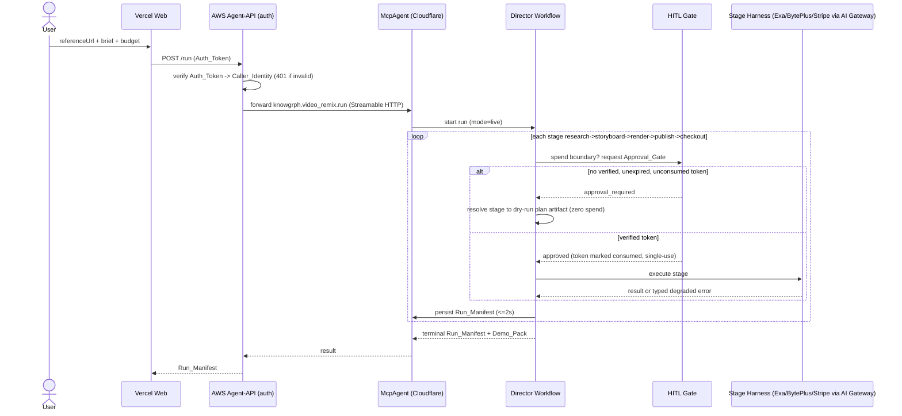

# Knowgrph MCP Agentic Canvas OS — Demo

**Demos:** [`knowgrph-mcp-agentic-canvas-os-prd-tad.md`](knowgrph-mcp-agentic-canvas-os-prd-tad.md)

One autonomous agent takes a **reference video URL + a creative brief + a budget
cap** and drives the full loop — **research → storyboard → render → publish →
checkout** — ending in a **sold, R2-stored remix**. Every model call routes
through Cloudflare AI Gateway; every spend boundary is gated by a human
approval token. This page is the operator + judge walkthrough of that flow.

## Current status

- **Truthful state today:** the control plane, local contracts, and thin AWS /
  AgentCore / web tiers are already strong enough to support a high-ROI live
  path, but the immediate product-ready seam is the in-session frontend flow,
  not yet the full `POST /run` + `/approvals` + `/runs/{id}` browser story.
- **Immediate live-product-ready target:** frontend mints its own
  `Auth_Token`, submits `POST /run`, then re-submits the same run with updated
  `approvals[]` after each user decision.
- **Sample-native target next:** the AgentCore wrapper is then aligned to the
  current `agentcore-cli` project conventions (`dev`, `deploy`, `invoke`,
  generated `agentcore/` config layout). That migration is additive and follows
  the first live product proof.

## At a glance

| | |
|---|---|
| **Hero tool** | `knowgrph.video_remix.run` (+ 5 stage tools) over MCP Streamable HTTP |
| **Control plane** | Cloudflare Workers `McpAgent` (Agents SDK) at `airvio.co/knowgrph/mcp` |
| **Product tiers** | AWS Agent-API (API Gateway + Lambda + S3) · Vercel frontend — **hold no model keys** |
| **Model routing** | All calls via Cloudflare AI Gateway (cache, token count, fallback, unified billing) |
| **Providers** | Exa (research) · BytePlus/ModelArk (reasoning + media) · Stripe (checkout/payout) |
| **Safety** | Dry-run by default; 6 approval gates; single-use 15-min Approval_Tokens; budget meters |
| **Default behavior** | Live mode **without** approvals halts at the first spend gate with **zero** paid actions |

## The hero flow

```mermaid
flowchart LR
  url[Reference URL + brief + budget] --> ingest[AWS Agent-API: auth + validate]
  ingest --> research[Research · Exa via AI Gateway]
  research --> evidence[(Evidence_Pack: 3..50 cited sources)]
  evidence --> story[Storyboard · BytePlus via AI Gateway]
  story --> kgc[(Kgc_Document: kgc-computing-flow/v1, 1 node per shot)]
  kgc --> gate{Approval_Gate verified?}
  gate -->|"no token"| blocked[Dry-run plan artifact · state: blocked · zero spend]
  gate -->|"verified token"| render[Render · BytePlus/Strytree queue]
  render --> r2[(R2 asset + Credit_Ledger event)]
  r2 --> sell[Stripe checkout + gated payout]
  sell --> manifest[(Run_Manifest + 7-section Demo_Pack)]
  manifest --> ui[Vercel UI: asset + receipt + manifest]
```





## Live demo script (operator)

> Endpoints are environment-driven (no hardcoded URLs). The deploy is
> operator-gated behind the `cloud-deploy` Approval_Token — see the
> [deploy runbook](../../knowgrph/docs/knowgrph-acos-deploy-runbook.md).
> `<AGENT_API>` is the deployed AWS Agent-API base URL.

### 0. Open a session

```
POST <AGENT_API>/auth/session            ->  { token }   # HS256 JWT, server-side secret only
```

### 1. Submit the run — and prove it fails safe (AC-1)

```
POST <AGENT_API>/run
Authorization: Bearer <token>
{ "referenceUrl": "https://example.com/reference-clip",
  "brief": "Turn this product teaser into a 30s vertical promo.",
  "budgetUsd": 25.00,
  "approvals": [] }
```

**Expected (no approvals):** `state: "blocked"`, `approvalGates.length >= 5`,
`budgetMeters.estimatedCostUsd == 0`, and **zero** Stripe/BytePlus/Exa/deploy
calls logged. The agent shows the planned stages + budget upfront and stops at
the first spend boundary. *This is the headline safety demo.*

### 2. Approve gates and run the full loop

Approve each spend gate, then **re-submit the same run with updated
`approvals[]`**. This is the immediate high-ROI product path because the
backend already accepts `approvals[]`; it does **not** require a separate
browser `/approvals` route. The Director now executes:

1. **Research** — Exa via AI Gateway → an Evidence_Pack of 3–50 cited
   Source_Cards (every downstream claim references a `sourceId`; weak signal
   < 3 sources halts before storyboard, never fabricates).
2. **Storyboard** — BytePlus chat via AI Gateway → a `kgc-computing-flow/v1`
   canvas doc with **exactly one node per planned shot** (renderable on the
   knowgrph canvas; reasoning failure falls back to a valid single-node plan).
3. **Render** — dispatch per shot through the BytePlus/Strytree queue → one
   R2 asset reference + one Credit_Ledger event per shot (keyless / over-budget
   routes to a deterministic zero-spend mock provider).
4. **Publish + Checkout** — Stripe checkout session created only when
   `payment-action` is approved; payout settles only after explicit approval.

### 3. Read back the evidence

```
POST /run response          ->  current Run_Manifest rendered in-session (immediate path)
GET <AGENT_API>/health      ->  200 within 5s (open liveness, discloses nothing sensitive)
```

> **Read-back note:** `GET <AGENT_API>/runs/{id}` is now implemented in the AWS
> Agent-API as a durable manifest read-back path when `ARTIFACT_BUCKET` is
> configured and the same browser session owns the run. Treat the remaining gap
> as **deployed proof**, not local implementation: the live environment still
> needs one captured end-to-end run showing persisted read-back from the hosted
> frontend.

### 4. One-command reachability gate (AC-7)

```
AGENT_API_URL=<AGENT_API> MCP_ENDPOINT=https://airvio.co/knowgrph/mcp \
FRONTEND_URL=<vercel-url> npm run runtime:verify
```

Probes all three `/health`/reachability surfaces (5s-bounded) and emits a
sample `demoPack.urls[]`. Also wired as CI: `.github/workflows/runtime-gate.yml`
runs `runtime:test` + `runtime:verify` on a deploy trigger (endpoints from repo
Variables / dispatch inputs — no hardcode).

## Acceptance criteria — live evidence

| AC | What the demo shows | `/goal` condition |
|---|---|---|
| **AC-1** Live run, gated | Step 1: no approvals → halts, zero spend | `state "blocked", approvalGates>=5, estimatedCostUsd==0, no paid call logged` |
| **AC-2** Research sourced | Evidence_Pack with cited sources | `evidencePack.sources>=3 and every claim.sourceCardIds non-empty` |
| **AC-3** Storyboard on canvas | KGC shot-plan doc on the canvas | `parses kgc-computing-flow/v1 and flow.nodes==planned shots` |
| **AC-4** Render reuses pipeline | R2 asset + ledger id per shot | `asset URL under knowgrph media bucket + credit-ledger event id` |
| **AC-5** Sale + payout gated | Stripe session; payout only post-approval | `session id; settle_payout only if payment-action approved` |
| **AC-6** Failure bounded | Injected tool failure → bounded retry / fail closed | `retryCount>=1 then complete or blocked, never exceeding maxIterations` |
| **AC-7** Deployed live | Reachable Vercel + AWS `/health` in the demo pack | `demoPack.urls has a reachable frontend URL + AWS /health 200` |

## Judging-dimension map

| Dimension | Live evidence in this demo |
|---|---|
| Agent Overview | Director + 4 stage harnesses behind one `knowgrph.video_remix.run` tool |
| Autonomy & Decision-Making | Agents SDK `AgentWorkflow` agentic loop; weak-signal halt; budget-cap halt |
| Actions & Tool Use | Exa search, BytePlus reasoning/media, knowgrph canvas, BytePlus render, Stripe checkout — all via Cloudflare AI Gateway |
| Orchestration | Strict stage ordering + fan-out render queue + durable Run_Manifest persistence |
| Human-in-the-Loop | 6 approval gates; single-use 15-min Approval_Tokens; auth never substitutes for approval |
| Failure Handling | Bounded exponential-backoff retry, fail-closed `blocked` with a failure record; degraded provider error |
| Demo & Presentation | 7-section Demo_Pack with reachable URLs, citations, rendered asset, Stripe session |

## Spend isolation & safety (what judges can verify)

- **Stack boundary (R11):** AWS and Vercel hold **no** model provider keys, never
  call paid models directly, and never bypass an approval gate. Enforced by
  static secret-scan smoke tests across all tiers.
- **Auth ≠ approval (R15.9):** a valid Auth_Token gates *access*; it never
  authorizes spend — every paid action still requires a fresh Approval_Token.
- **Token economics:** every model call emits a Cost_Log via AI Gateway; the
  Director aggregates into Budget_Meters; the Credit_Ledger reconciles within
  ±0.01 USD or flags a discrepancy (both records preserved).
- **Fail closed:** un-configured deploys return HTTP 501 rather than making an
  accidental live call; live clients activate only when their credentials are
  present (`KNOWGRPH_LIVE_CLIENTS` / `EXA_API_KEY` / endpoint vars).

## Immediate remediation checklist

- **Docs first:** keep the demo truthful about what is already live, what is
  in-session only, and what is a next seam.
- **Web next:** mint the auth session in-browser, then convert approval clicks
  into re-submitted `approvals[]` on `POST /run`.
- **AWS next:** supply `MCP_ENDPOINT` and CORS-ready response headers from the
  deploy path so the browser can reach the live forwarder directly.
- **AgentCore after live proof:** keep AgentCore as the additive AWS MCP surface,
  then align it with the current sample-native CLI workflow.

## Reproduce locally (network-free, no credentials)

The whole contract is provable offline with deterministic in-memory seams —
zero live/paid calls:

```
npm run runtime:test     # full suite: unit + property-based + smoke, deterministic
```

This exercises the approval-gate invariant, the live-without-approvals halt,
dry-run zero-spend, the Kgc_Document round-trip, ledger/budget reconciliation,
bounded-retry fail-closed, the Demo_Pack assembler, and the Agent-API
auth/authorization logic — all with mocked providers. The same harnesses accept
live drop-in clients (Exa / BytePlus / Strytree / Stripe) when credentials are
wired, with the deterministic mocks as the test default.

## Demo pack (7 sections)

A terminal run assembles one Demo_Pack mapping to the seven judging dimensions,
each section marked `verified` only when its URL/artifact is reachable:

```
Demo_Pack {
  urls: [{ url, kind }]            // >=1 frontend + >=1 Agent_Api endpoint
  sections: [                      // one per dimension, non-empty
    Agent Overview, Autonomy & Decision-Making, Actions & Tool Use,
    Orchestration, Human-in-the-Loop, Failure Handling, Demo & Presentation
  ]
}
```

## Topology note

The connector ships as a **`knowgrph` monorepo** (control plane + AWS/Vercel
product tiers + shared contracts in one repo); `agentic-canvas-os` is a future
split target, not a runtime prerequisite. The stack boundary is enforced by
directory ownership + secret-scan smoke tests, not repo separation. See
[`knowgrph/docs/knowgrph-acos-topology-decision.md`](../../knowgrph/docs/knowgrph-acos-topology-decision.md).
