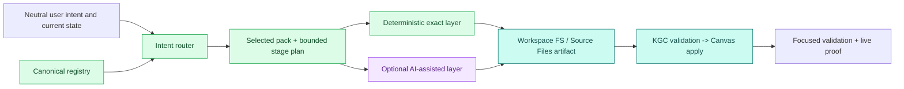
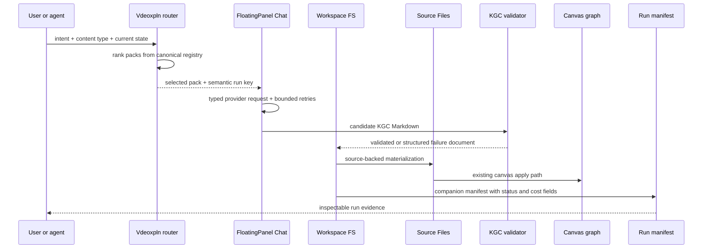

# Knowgrph Vdeoxpln - Interactive Visual Explanation

This document turns the vdeoxpln contract into an inspectable visual artifact.
It is both a readable Markdown explanation and a Knowgrph frontmatter-flow seed:
import or open it in Knowgrph to inspect the graph nodes, edges, policies, and
owner references on Canvas. The seed requests XR Mode and includes Rich Media
Panel cards for script text, key-frame image, and explainer-video review.

The external reference boundary is concept-only: manifest-governed skills,
file-backed intermediate artifacts, exact layers separated from optional AI
support, and QA before publication. No external source, schema, prompt, example,
asset, name, route, or prose is copied.

Live inspection entry points:

| Surface | What to inspect | Link or command |
|---|---|---|
| Published skill index | Current pack names, scopes, tools, and validation hashes | <https://airvio.co/knowgrph/.well-known/agent-skills/index.json> |
| Chat-to-Canvas skill | Browser-local mutating boundary and KGC path | <https://airvio.co/knowgrph/.well-known/agent-skills/knowgrph-chat-to-canvas.md> |
| Source Files skill | Published read-only document and Source Files inspection | <https://airvio.co/knowgrph/.well-known/agent-skills/knowgrph-source-files.md> |
| Local MCP | Registry snapshot and neutral route preview | `knowgrph.vdeoxpln.list` |
| Validation | Source, mirror, and live drift checks | `npm run vdeoxpln:check && npm run pages:check-sync && npm run agent-ready:check` |

## The Core Idea

A vdeoxpln is not a folder name and not a route shortcut. It is a signed
capability contract:



The important movement is from abstract request to file-backed evidence:

1. Intent is normalized from user request, content type, requested output, and
   current workspace state.
2. The router ranks registry packs. It ignores routes, filenames, absolute
   paths, demo ids, and provider keys.
3. The selected pack emits a bounded stage plan and semantic run key.
4. Exact work stays with deterministic owners: parsers, Source Files,
   Workspace FS, KGC validation, Canvas apply, MCP contracts, and Pages routes.
5. Optional AI work stays inside FloatingPanel Chat with typed request inputs,
   retry bounds, token/cost fields, and fallback artifacts.
6. Material output becomes a workspace/source artifact and can be inspected,
   edited, recomposed, validated, and published.

## Pack Matrix

| Pack | Use when | Exact layer | Optional AI layer | Artifact / inspection output |
|---|---|---|---|---|
| `knowgrph-source-files` | Read or inspect published documents and Source Files. | Published storage readers, shared document structure inspection, Source Files signatures. | None. | Source index, published Markdown, structure report. |
| `knowgrph-agent-ready` | Inspect health, MCP, WebMCP, A2A, OpenAPI, and readiness. | Agent-ready route metadata, tool contract, browser-local snapshots. | None. | Agent surface report and browser-local readiness snapshot. |
| `knowgrph-mcp-local` | Launch local UI, run local pipelines, inspect vdeoxpln, or use browser API bridge. | Local stdio MCP server and guarded local-root tools. | Optional only through local tool owners. | Local tool result, pipeline artifact, registry snapshot. |
| `knowgrph-chat-to-canvas` | Generate or apply graph material from chat through KGC. | KGC validation, Workspace FS, Source Files, Canvas apply, semantic-key owner. | Required for graph generation, bounded by chat settings and validation retries. | Validated KGC Markdown, workspace artifact, GraphData, Canvas topology snapshot. |
| `knowgrph-strybldr` | Convert image/media source units into editable storyboard cards and handoff artifacts. | Strybldr, Storyboard model, Source Files, Workspace FS, renderer config. | Optional refinement or media handoff only after user approval. | Strybldr Markdown, storyboard cards, media handoff prompt, Canvas snapshot. |
| `knowgrph-research-visual` | Explain a formula, mechanism, algorithm, proof, or research visual workflow. | Parser, Source Files, Storyboard model, renderer selection, semantic-key owner. | Optional drafting support through FloatingPanel Chat. | Mechanism brief, storyboard, renderer-neutral scene plan, validated KGC Markdown. |
| `knowgrph-commerce-readiness` | Inspect payment, x402, ACP, UCP, MPP, Stripe, and commerce readiness boundaries. | Commerce hub, payment worker metadata, payment SSOT. | None. | Commerce readiness report, route summary, agent-ready commerce metadata. |

## Interactive Inspection Cards

<details open>
<summary>1. How discovery stays accurate</summary>

Discovery is generated from the canonical registry, then projected to Pages
agent-skills, local MCP docs, browser WebMCP capability metadata, and MainPanel
cards. A new pack is valid only when its id is unique, every referenced owner
exists, every tool resolves to the local MCP or agent-ready contract, and no
compatibility alias is needed.

Inspect it live at the skill index route, or locally with
`knowgrph.vdeoxpln.list`.
</details>

<details>
<summary>2. How routing avoids hardcoded triggers</summary>

Routing reads neutral signals:

- user intent
- content type
- requested output family
- workspace state
- graph/source presence
- browser-local or local MCP capability metadata

Routing intentionally ignores:

- absolute local paths
- public routes
- filenames
- demo corpus names
- provider keys
- legacy aliases

If no pack matches, the correct output is a decline with the missing capability,
not a fallback fixture.
</details>

<details>
<summary>3. How a Chat-to-Canvas run becomes inspectable</summary>

The selected `knowgrph-chat-to-canvas` pack injects its execution contract into
the FloatingPanel Chat request. The provider response must pass KGC validation.
Finalization writes the canonical KGC workspace document, applies it through the
Canvas bridge, and writes a KGC companion run manifest with:

- selected pack id
- semantic run key
- status
- provider and model fields
- usage and finish reason fields
- Canvas apply result
- structured failure state when needed

The run manifest is the inspection handle for the abstract "skill execution"
concept.
</details>

<details>
<summary>4. How exact layers and AI layers stay separate</summary>

Exact layers are deterministic and source-owned: schemas, graph topology,
route metadata, parser output, source provenance, formula labels, KGC validation,
Canvas apply, and published discovery hashes.

AI layers are bounded support stages: drafting, enrichment, or cinematic
assistance. They must declare max attempts, token budget, cost visibility, and a
fallback path. If provider credentials are unavailable, exact artifacts still
exist and remain reviewable.
</details>

<details>
<summary>5. How publication avoids mirror drift</summary>

The production mirror is output, not source truth. The safe chain is:

`Dev registry and owners -> pages build -> prod mirror sync -> Cloudflare Pages deploy -> live agent-ready smoke`

Manual mirror-only edits are forbidden because they fork the contract.
`pages:check-sync` and `agent-ready:check` are the drift detectors.
</details>

## What Moves During A Run



## Visual Vocabulary

| Shape in this document | Runtime meaning | Inspection question |
|---|---|---|
| Concept card | Product pattern or user intent. | Is this only a concept, or did it become a source-owned contract? |
| Contract card | Registry, router, policy, semantic-key, or owner map. | Is there one source of truth? |
| Tool card | MCP, WebMCP, Pages, or MainPanel capability. | Is the scope read-only, browser-local, or local-confirmed? |
| Artifact card | Workspace FS, Source Files, KGC, or run manifest. | Can the output be read and reviewed outside chat state? |
| Rich Media Panel | Text, image, or video inspection surface. | Does each media kind render through the shared panel owner? |
| Verify card | Tests, sync checks, smoke checks, or validation rules. | Would drift, stale ids, or route-only matching fail? |

## Runtime Owner Map

| Concern | Current owner | Why it matters |
|---|---|---|
| Registry, routing, semantic run key, generated Markdown | `canvas/src/features/agent-ready/knowgrphVdeoxplnContract.mjs` | Prevents duplicate registries and stale aliases. |
| Source-backed run manifest | `canvas/src/features/chat/knowgrphVdeoxplnChatArtifacts.ts` | Records selected pack, status, cost fields, and Canvas apply result. |
| Chat prompt injection | `canvas/src/features/chat/floatingPanelChat/floatingPanelChatSubmitRequest.ts` | Ensures provider-bound requests receive the selected pack contract. |
| Chat finalization | `canvas/src/features/chat/floatingPanelChat/useFinalizeAssistantSuccess.ts` | Persists KGC output, applies Canvas, and writes the companion manifest. |
| Workspace persistence | `canvas/src/features/workspace-fs/workspaceFs.ts` | Keeps material outputs reviewable and editable. |
| Source recomposition | `canvas/src/features/source-files/applyComposedGraphFromSourceFiles.ts` | Reuses signatures and avoids duplicate graph materialization. |
| KGC validation | `canvas/src/features/chat/chatMarkdownValidation.ts` | Blocks invalid graph material before apply. |
| Canvas apply | `canvas/src/features/chat/chatKgcCanvasApply.ts` | Keeps graph mutation on the existing apply path. |
| Local MCP list and routing preview | `mcp/local-tool-contract.js`, `mcp/server.js` | Gives local agents an inspectable registry snapshot without a new graph path. |
| Published discovery | `cloudflare/pages/knowgrph-agent-ready.mjs` | Serves generated skill metadata on Cloudflare Pages. |

## Inspectable Registry Snapshot

```json knowgrph-vdeoxpln-inspector
{
  "schema": "knowgrph-vdeoxpln-inspector/v1",
  "generated_for": "docs/knowgrph-vdeoxpln.md",
  "source_truth": "canvas/src/features/agent-ready/knowgrphVdeoxplnContract.mjs",
  "reference_boundary": "Concept-only product patterns; no copied implementation artifacts, names, routes, examples, prompts, schemas, or prose.",
  "routing_ignores": ["routePath", "filePath", "absolutePath", "url", "demoName", "providerKey"],
  "visual_explainer": {
    "surfaceMode": "xr",
    "renderMode": "3d",
    "textArtifactToExplainerVideo": true,
    "richMediaPanelTabs": ["text", "image", "video"],
    "owner": "canvas/src/lib/render/richMediaSsot.ts"
  },
  "packs": [
    {
      "id": "knowgrph-source-files",
      "scope": "read-only-published",
      "mutation": "read-only",
      "outputs": ["source-files index", "published markdown", "document structure report"],
      "artifact_persistence": "published-read-only",
      "graph_materialization": "none"
    },
    {
      "id": "knowgrph-agent-ready",
      "scope": "read-only-published-and-browser-local",
      "mutation": "read-only",
      "outputs": ["agent surface inspection", "browser-local readiness snapshot", "metadata report"],
      "artifact_persistence": "inspection-only",
      "graph_materialization": "none"
    },
    {
      "id": "knowgrph-mcp-local",
      "scope": "local-stdio",
      "mutation": "local-confirmed",
      "outputs": ["local tool result", "pipeline artifact", "superagent report", "vdeoxpln registry snapshot"],
      "artifact_persistence": "local-workspace",
      "graph_materialization": "tool-owned"
    },
    {
      "id": "knowgrph-chat-to-canvas",
      "scope": "browser-local-ai-assisted",
      "mutation": "browser-local-user-mediated",
      "outputs": ["validated KGC Markdown", "workspace artifact", "GraphData", "canvas topology snapshot"],
      "artifact_persistence": "workspace-fs-and-source-files",
      "graph_materialization": "kgc-validation-to-canvas-apply"
    },
    {
      "id": "knowgrph-strybldr",
      "scope": "browser-local-source-backed",
      "mutation": "browser-local-user-mediated",
      "outputs": ["Strybldr Markdown", "Storyboard graph cards", "media handoff prompt", "canvas snapshot"],
      "artifact_persistence": "workspace-fs-and-source-files",
      "graph_materialization": "storyboard-graph"
    },
    {
      "id": "knowgrph-research-visual",
      "scope": "browser-local-ai-assisted",
      "mutation": "browser-local-user-mediated",
      "outputs": ["mechanism brief", "storyboard", "renderer-neutral scene plan", "validated KGC Markdown"],
      "artifact_persistence": "workspace-fs-and-source-files",
      "graph_materialization": "kgc-validation-to-canvas-apply"
    },
    {
      "id": "knowgrph-commerce-readiness",
      "scope": "read-only-published-and-browser-local",
      "mutation": "read-only",
      "outputs": ["commerce readiness report", "payment route summary", "agent-ready commerce metadata"],
      "artifact_persistence": "inspection-only",
      "graph_materialization": "none"
    }
  ],
  "validation": [
    "npm run vdeoxpln:check",
    "npm --prefix canvas run test:ci:unit -- vdeoxpln",
    "npm --prefix canvas run test:ci:unit -- mcp.server.localToolContract",
    "npm --prefix canvas run test:ci:unit -- chat.responseContract.request",
    "npm --prefix canvas run test:ci:unit -- chat.responseContract.storage.kgcFinalizeAppliesCanvasGraph",
    "npm run pages:check-sync",
    "KNOWGRPH_AGENT_READY_BASE_URL=https://airvio.co/knowgrph npm run agent-ready:check"
  ]
}
```

## Failure States To Inspect

| Failure | Correct behavior | Forbidden behavior |
|---|---|---|
| No matching neutral intent | Decline and report missing capability. | Use a hardcoded fallback fixture. |
| Route-only or filename-only input | Decline because route and file identity are ignored. | Select a pack from URL or path text. |
| Provider unavailable | Persist deterministic fallback or structured failure state. | Block exact layers or synthesize success. |
| Invalid KGC | Retry within bound, then persist failure. | Apply invalid graph data to Canvas. |
| Mirror drift | Fail sync check and regenerate from Dev. | Patch the production mirror by hand. |
| Stale pack id | Remove and validate source references. | Add compatibility alias tables. |

## Quick Manual Walkthrough

1. Open the live skill index and confirm seven canonical pack ids.
2. Open `knowgrph-chat-to-canvas.md` and inspect its browser-local mutation
   boundary.
3. In local MCP, call `knowgrph.vdeoxpln.list` with an `intentText` such as
   "generate a graph from source evidence and apply KGC to Canvas".
4. Confirm routing selects `knowgrph-chat-to-canvas` from neutral intent and
   state signals, not from the route or filename.
5. Run a browser-local Chat-to-Canvas flow.
6. Inspect the KGC workspace document and the sibling
   `kgc-output_*-vdeoxpln-run.md` manifest.
7. Confirm Canvas apply status, provider/model fields, usage summary, and
   failure state are visible in the manifest.

## Design Boundary

This document intentionally avoids:

- copying external skill names, schemas, prompts, examples, assets, or wording
- creating a second graph materialization path
- treating Cloudflare Pages as a mutating execution surface
- preserving stale ids through aliases
- hardcoding demo documents, provider keys, route labels, or local paths into
  runtime selection

The result is a Knowgrph-native explanation: abstract vdeoxpln ideas become a
frontmatter graph, a Mermaid flow, expandable inspection cards, a registry
snapshot, and a validation runbook, all anchored to current Knowgrph owners.
